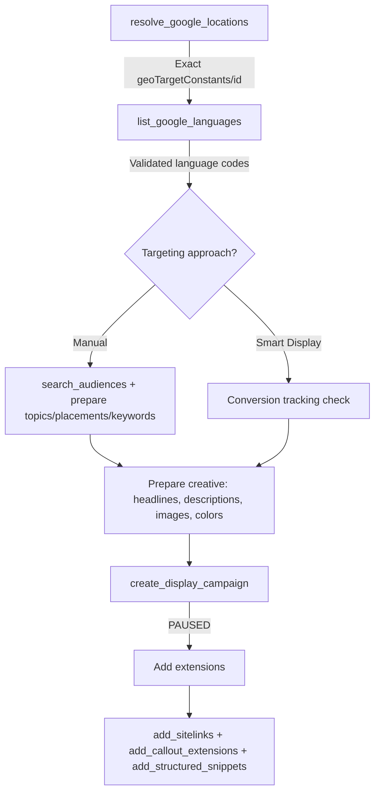

# Google Display Ads Integration

Reach people across millions of websites, apps, and YouTube display slots with Responsive Display Ads. Full campaign lifecycle — creation, five targeting surfaces, creative edits, frequency caps, and schedules — all managed through natural language.

## Prerequisites

<Note>
- Google Ads account ([create one here](https://ads.google.com))
- An active ad account with billing information
- Admin or Standard access to the account you want to manage
- At least one landscape image (1.91:1) and one square image (1:1) for ad creative
- Adspirer account connected via [Claude Code](/ai-clients/claude-code), [Cursor](/ai-clients/cursor), or any [supported AI client](https://www.adspirer.com/integrations)
</Note>

## Connecting Display Ads

Display Ads runs through Google Ads — if you've already connected Google Ads, you're ready. No separate connection needed.

1. Open your AI assistant (ChatGPT, Claude, Claude Code, etc.)
2. Say: "Connect my Google Ads account"
3. Adspirer opens your browser for OAuth authorization
4. Sign in to your Google account and select the ad account
5. Approve permissions

Verify the connection:

```
Check my connected ad platforms
```

## What You Can Do (27 Display Tools)

### Campaign Creation & Structure

- `create_display_campaign` — Create a standard Display or Smart Display campaign (created PAUSED)
- `add_display_ad_group` — Add additional ad groups with independent targeting
- `add_display_ad` — Add additional Responsive Display Ads to an existing ad group
- `select_google_campaign_type` — Choose between Search, PMax, Display, YouTube, or Demand Gen when the campaign type isn't specified

### Targeting (5 Surfaces — GET / ADD / REMOVE each)

- `get_display_audiences` / `add_display_audiences` — In-market, affinity, custom audiences, user lists
- `get_display_topics` / `add_display_topics` — Google content categories (Finance, Travel, etc.)
- `get_display_placements` / `add_display_placements` — Specific websites, apps, YouTube channels, YouTube videos
- `get_display_keywords` / `add_display_keywords` — Contextual keywords (always BROAD match on Display)
- `get_display_demographics` / `update_display_demographics` — Age, gender, parental status, income exclusions
- `remove_display_criteria` — Unified removal across all 5 targeting surfaces

### Creative & Campaign Edits

- `update_display_ad_creative` — Change colors, CTA, images, videos, promo text, format_setting on an existing ad
- `update_display_ad_group` — Rename or repoint an ad group
- `update_display_campaign_schedule` — Edit start/end dates and ad-schedule day/hour windows
- `get_display_frequency_caps` / `update_display_frequency_caps` — View and edit impression caps per user
- `get_display_ad_group_settings` — Inspect current bidding, status, and targeting on an ad group
- `remove_display_ad` / `remove_display_ad_group` — Clean up ads and ad groups

### Geo & Language Resolution (Required Pre-Step)

- `resolve_google_locations` — Resolve location names to exact `geoTargetConstants/<id>` (rejects ambiguous inputs — e.g., "Baja" surfaces 5 candidates, no silent US fallback)
- `list_google_languages` — Resolve language codes (rejects unknown codes with a clear pointer)

### Reused Lifecycle Tools (Work Across All Google Campaign Types)

- `list_campaigns`, `get_campaign_structure`, `get_campaign_targeting`
- `pause_campaign`, `resume_campaign`, `update_campaign_budget`
- `add_sitelinks`, `add_callout_extensions`, `add_structured_snippets`
- `get_campaign_performance`, `analyze_wasted_spend`, `optimize_budget_allocation`

## Campaign Types

### Standard Display Campaign

Full manual control over targeting. You choose audiences, topics, placements, keywords, and demographics. Best when you have specific audience data or want to retarget website visitors.

**When to use:** Retargeting, brand-safety-sensitive verticals, known audience segments, specific placement strategies (e.g., industry publications).

### Smart Display Campaign

Google-managed variant. Google's AI auto-targets, auto-bids (`TARGET_CPA` required), and auto-generates ad combinations. Manual targeting fields are rejected.

**When to use:** You have conversion tracking + 50+ Display conversions in the last 30 days and want Google's AI to do the heavy lifting.

<Warning>
Smart Display requires `bidding_strategy=TARGET_CPA` and sufficient conversion history. If you pass any manual targeting (`audience_segments`, `topics`, `managed_placements`, `display_keywords`, `demographics`) with `smart_display=true`, the campaign creation will be rejected — Smart Display is fully automated.
</Warning>

## Campaign Creation Workflow

Display campaigns follow a 6-step workflow:



```
1. resolve_google_locations
   -> (names -> exact geoTargetConstants/<id>; rejects ambiguous "Baja"-style inputs)
2. list_google_languages
   -> (validate ISO language codes; no silent fallbacks)
3. search_audiences (if using manual audience targeting)
   -> (find real in-market/affinity/custom audience IDs — never fabricate)
4. Prepare creative assets
   -> (1-5 headlines ≤30 chars, 1 long headline ≤90, 1-5 descriptions ≤90,
       ≥1 landscape image 1.91:1, ≥1 square image 1:1, optional logos/videos)
5. create_display_campaign
   -> (campaign + default ad group + RDA created PAUSED — you review before launching)
6. add_sitelinks + add_callout_extensions + add_structured_snippets
   -> (extensions lift CTR 15-25%)
```

## Asset Requirements

### Required

| Asset | Count | Spec |
|-------|:-----:|------|
| **Short headlines** | 1-5 | Max 30 characters each |
| **Long headline** | 1 | Max 90 characters |
| **Descriptions** | 1-5 | Max 90 characters each |
| **Business name** | 1 | Max 25 characters |
| **Landscape images** | 1+ | 1.91:1, min 600×314, max 5MB |
| **Square images** | 1+ | 1:1, min 300×300, max 5MB |
| **Final URL** | 1 | Must be HTTPS |

### Optional

| Asset | Count | Spec |
|-------|:-----:|------|
| **Landscape logos** | 0-5 | 4:1 |
| **Square logos** | 0-5 | 1:1, min 128×128 |
| **YouTube videos** | 0-5 | 11-char YouTube video IDs |
| **Main color** | 1 | Hex (e.g., `#112233`) |
| **Accent color** | 1 | Hex (e.g., `#FFAABB`) |
| **Price prefix** | 1 | Max 10 chars (e.g., "from") |
| **Promo text** | 1 | Max 20 chars (e.g., "Up to 50% off") |

You can also reuse existing image assets already in your Google Ads account via the `existing_images` parameter — pass resource names instead of re-uploading.

## Bidding Strategies

| Strategy | Best For | Required Field | Conversion Tracking |
|----------|----------|----------------|:-------------------:|
| **MAXIMIZE_CLICKS** (default) | Most campaigns, driving traffic | — | No |
| **MAXIMIZE_CONVERSIONS** | Optimizing for signups/purchases | — | Yes |
| **TARGET_CPA** | Cap cost per acquisition | `target_cpa` | Yes |
| **TARGET_ROAS** | E-commerce, revenue optimization | `target_roas` (e.g., 3.5 = 350%) | Yes |
| **MANUAL_CPC** | Full bid control | `cpc_bid` | No |
| **MANUAL_CPM** | Viewable CPM (awareness) | `cpm_bid` | No |

Smart Display requires `TARGET_CPA`.

## Targeting Surfaces

Standard Display campaigns support five independent targeting layers. Mix and match — they intersect, so narrower targeting = narrower reach.

### Audiences

- **In-market** — People actively researching a purchase in a category
- **Affinity** — Long-term interest-based segments (e.g., "Outdoor Enthusiasts")
- **Custom audiences** — Segments you build from keywords, URLs, or app interests
- **User lists** — Your remarketing lists and Customer Match uploads
- **Combined audiences** — AND/OR combinations of the above

Use `search_audiences` first to find real audience IDs — never fabricate them.

### Topics

Google's content categorization tree (Finance > Personal Finance > Credit & Lending, etc.). Ads serve on pages matching the selected topics.

### Managed Placements

Target specific URLs, mobile apps, YouTube channels, or YouTube videos. Most precise targeting available on Display.

```
[
  {"type": "website", "value": "example.com"},
  {"type": "youtube_channel", "value": "UCxxxx"},
  {"type": "mobile_app", "value": "com.example.app"}
]
```

### Display Keywords

Contextual — ads serve on pages **about** those keywords (always BROAD match on Display). Pass `negative=true` for negative keywords.

### Demographics

Exclude demographic groups you don't want to reach. Age ranges, genders, parental statuses, income ranges.

<Info>
Demographics on Display are **exclusion-based**. Whatever you list is **kept**; whatever you don't list is **excluded**. Be deliberate — omitting `genders` entirely means no gender filter, but passing `["MALE"]` excludes FEMALE and UNDETERMINED.
</Info>

## Example Prompts

### Create a Standard Display Campaign

<Prompt description="End-to-end Display campaign with audience + topic + placement targeting." actions={["copy", "cursor"]}>
Create a Google Display campaign:
- Business: B2B project management SaaS
- Landing page: https://example.com/signup
- Business name: ProjectHub
- Budget: $30/day
- Target locations: United States, Canada
- Audiences: in-market for "Business Software", affinity "Technophiles"
- Topics: Business & Industrial, Computers & Electronics
- Managed placements: techcrunch.com, theverge.com
- Creative: https://cdn.example.com/landscape.png and https://cdn.example.com/square.png
- Main color #2563eb, accent color #f59e0b
- 5 headlines and 3 descriptions
- Resolve locations + languages first, then launch
</Prompt>

### Retargeting Campaign with User Lists

<Prompt description="Display retargeting using an existing remarketing list." actions={["copy", "cursor"]}>
Set up a Display retargeting campaign for my e-commerce store:
- Remarketing list: "Website Visitors — Last 30 Days"
- Budget: $20/day
- Bidding: TARGET_CPA at $15
- Frequency cap: 3 impressions per user per day
- Locations: United States
- Creative: reuse existing landscape and square images from my account (check discover_existing_assets first)
- Promo text: "Welcome back — 15% off"
- CTA: SHOP_NOW
</Prompt>

### Smart Display Campaign

<Prompt description="Google-managed Smart Display for advertisers with conversion tracking." actions={["copy", "cursor"]}>
Create a Smart Display campaign:
- Business: Online fitness coaching
- Landing page: https://example.com/coaching
- Budget: $40/day
- Target CPA: $25
- Locations: United States
- Creative: 5 headlines, 1 long headline, 5 descriptions, landscape + square images, 1 logo
- This account has 200+ Display conversions in the last 30 days
</Prompt>

### Edit Creative on an Existing Display Ad

<Prompt description="Refresh colors, CTA, and images on a live Display ad." actions={["copy", "cursor"]}>
Update the creative on my Display ad ID [ad_id]:
- New main color #10b981
- Change CTA to BOOK_NOW
- Add 2 new landscape images: [url1], [url2]
- Remove the old promo text
- Set format_setting to NATIVE
</Prompt>

### Add Frequency Caps

<Prompt description="Cap impressions per user across a Display campaign." actions={["copy", "cursor"]}>
Set a frequency cap on my Display campaign [campaign_id]:
- 5 impressions per user per day
- 15 impressions per user per week
Show me the current caps first, then apply the change.
</Prompt>

## Geo & Language Resolution

<Tip>
Always run `resolve_google_locations` before `create_display_campaign` (or any campaign creation). Location strings like "London" are ambiguous — the resolver surfaces candidates (London UK, London Ontario, Londonderry) instead of silently picking one.
</Tip>

The resolver:

- Rejects ambiguous inputs with multiple candidates (you pick explicitly)
- Rejects unknown locations with a clear error
- Never silently falls back to "United States"
- Returns exact `geoTargetConstants/<id>` values Google Ads accepts

`list_google_languages` works the same way for ISO language codes.

## Budget Guidelines

- **Minimum:** $10/day (Google's practical minimum for Display)
- **Recommended:** $20-30/day for meaningful reach and data
- **Smart Display minimum:** $20+/day (Google's AI needs budget to learn)
- **Scaling:** Once CPA is below target, increase 20-30% every 5-7 days — Smart Display learning resets on big jumps

## Best Use Cases for Display Ads

- **Retargeting:** Re-engage website visitors and cart abandoners with visual reminders
- **Brand awareness:** Top-of-funnel reach across 2M+ sites and apps
- **Product catalogs:** Show product imagery at scale
- **Local businesses:** Geographic targeting with visual creative (works where Search volume is too low)
- **App install support:** Reinforce install campaigns with display creative
- **Complement Search:** Catch audiences before they type the query

**Not ideal for:** High-intent demand capture (use [Google Search Ads](/ad-platforms/google-ads)), B2B targeting by job title (use [LinkedIn Ads](/ad-platforms/linkedin-ads)), short-form social engagement (use [TikTok Ads](/ad-platforms/tiktok-ads)), video-first campaigns (use [YouTube Ads](/ad-platforms/youtube-ads)).

## Display vs Performance Max

| Feature | Display | Performance Max |
|---------|:-------:|:---------------:|
| Placements | Display Network only | Search + Display + YouTube + Gmail + Maps + Discover |
| Targeting control | Full manual (5 surfaces) | AI-driven, limited signals |
| Creative | Images + optional videos | Images + videos + feed required |
| Retargeting | Supported (user lists) | Limited |
| Minimum budget | $10/day | $20/day recommended |
| Best for | Retargeting, specific placements | Broad reach + automated optimization |

Run Display when you want precise control and specific audiences/sites. Run PMax when you want Google's AI to decide across every channel.

## Troubleshooting

### "Ambiguous location" error

The resolver flagged your input because multiple cities match. Fix by narrowing:

- `"London"` → `"London, United Kingdom"` or `"London, Ontario, Canada"`
- `"Baja"` → `"Baja California, Mexico"`

Or pass the exact `geoTargetConstants/<id>` from the resolver's candidate list.

### "Smart Display rejected manual targeting"

Smart Display is fully Google-managed. Remove `audience_segments`, `topics`, `managed_placements`, `display_keywords`, and `demographics`. Or switch to standard Display (`smart_display: false`).

### "Headline too long" error

Display short headlines are capped at **30 characters** (stricter than Search). The validator tells you the exact character count and how many to remove. Long headline (separate field) is capped at 90.

### Low CTR on Display

Common fixes:

- Add stronger color contrast (set `main_color` + `accent_color` explicitly)
- Include a promo text or price prefix to draw attention
- Test different CTA labels (SHOP_NOW, LEARN_MORE, GET_QUOTE, etc.)
- Refresh creative — Display fatigue kicks in faster than Search
- Narrow targeting — broad audiences dilute CTR

### "Audience ID not found"

Never fabricate audience IDs. Always run `search_audiences` first to get real resource names. In-market and affinity segments have Google-assigned IDs; custom audiences and user lists have account-specific resource names.

## FAQ

<AccordionGroup>
<Accordion title="Can I use the same creative for Display and PMax?">
Yes — both use image + video assets. You can reuse existing assets via the `existing_images` parameter instead of re-uploading. However, PMax also requires a product feed for e-commerce use cases; Display does not.
</Accordion>

<Accordion title="What's the difference between standard Display and Smart Display?">
**Standard Display** gives you full manual control — 5 targeting surfaces (audiences, topics, placements, keywords, demographics), any bidding strategy, fine-grained creative settings.

**Smart Display** is Google-managed. Google's AI auto-targets, auto-bids (`TARGET_CPA` required), and auto-optimizes creative combinations. You just upload assets and set a budget + target CPA. Requires conversion tracking and 50+ Display conversions in the last 30 days.
</Accordion>

<Accordion title="Do I need conversion tracking for Display?">
Only for Smart Display and for conversion-based bidding (`MAXIMIZE_CONVERSIONS`, `TARGET_CPA`, `TARGET_ROAS`). Standard Display with `MAXIMIZE_CLICKS`, `MANUAL_CPC`, or `MANUAL_CPM` works without conversion tracking.
</Accordion>

<Accordion title="How is Display different from retargeting on Meta Ads?">
**Google Display** reaches people across 2M+ websites, apps, and YouTube display slots. Targeting uses Google's ecosystem (in-market segments, user lists, topics).

**[Meta Ads](/ad-platforms/meta-ads)** retargeting reaches people on Facebook, Instagram, Messenger, and Audience Network. Targeting uses Meta's social graph (custom audiences, lookalikes).

Most advertisers run both — Google Display catches users browsing the open web; Meta catches them in social feeds.
</Accordion>

<Accordion title="Can Adspirer create the display images for me?">
No. Adspirer manages campaigns, not asset generation. You provide image URLs (Google Drive, Dropbox, S3, CDN, or any public URL) and Adspirer validates + uploads them to Google Ads. Use your preferred design tools (Canva, Figma, Photoshop) for the creative.
</Accordion>

<Accordion title="What ad format should I use — NATIVE, NON_NATIVE, or ALL_FORMATS?">
**ALL_FORMATS** (default) serves across every Display placement — maximum reach.

**NATIVE** restricts to placements where ads blend with the surrounding content (recommended for premium publishers, higher CPM, better engagement).

**NON_NATIVE** restricts to standard banner placements (useful for testing reach vs quality).

Start with ALL_FORMATS. Switch to NATIVE if you see low-quality placements consuming budget.
</Accordion>

<Accordion title="How much does Adspirer cost for Display Ads?">
Adspirer pricing is based on tool calls, not ad spend. Free tier: 15 calls/month. Plus: $49/mo for 150 calls. Pro: $99/mo for 600 calls. Max: $199/mo for 3,000 calls. A typical Display campaign creation uses 5-7 tool calls (resolve locations + resolve languages + search audiences + create campaign + add extensions). See [full pricing](https://www.adspirer.com/pricing?utm_source=docs&utm_medium=page&utm_content=pricing).
</Accordion>
</AccordionGroup>

## Related Documentation

- [Google Ads Integration](/ad-platforms/google-ads) — Search + PMax
- [YouTube Ads Integration](/ad-platforms/youtube-ads) — Video-first Google campaigns
- [Meta Ads Integration](/ad-platforms/meta-ads) — Social retargeting alternative
- [LinkedIn Ads Integration](/ad-platforms/linkedin-ads) — B2B targeting
- [TikTok Ads Integration](/ad-platforms/tiktok-ads) — Short-form social
- [Campaign Creation Workflows](/agent-skills/workflows)
- [Pricing & Plans](https://www.adspirer.com/pricing?utm_source=docs&utm_medium=page&utm_content=pricing)
