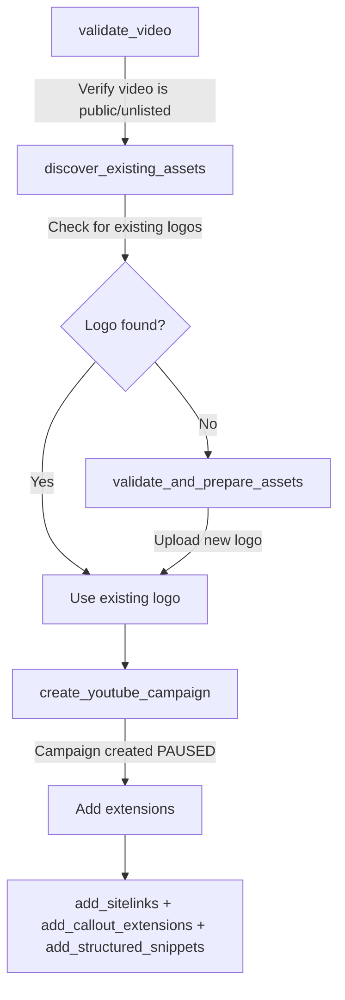

# YouTube Ads Integration

Run video ads across YouTube's 2+ billion monthly users. Create campaigns that show on In-Feed, In-Stream, and Shorts placements — all managed through natural language.

## Prerequisites

<Note>
- Google Ads account with an active YouTube channel ([create one here](https://ads.google.com))
- At least one YouTube video (public or unlisted) to use as ad creative
- Admin or Standard access to the Google Ads account
- Adspirer account connected via [Claude Code](/ai-clients/claude-code), [Cursor](/ai-clients/cursor), or any [supported AI client](https://www.adspirer.com/integrations)
</Note>

## Connecting YouTube Ads

YouTube Ads runs through Google Ads — if you've already connected Google Ads, you're ready. No separate connection needed.

1. Open your AI assistant (ChatGPT, Claude, Claude Code, etc.)
2. Say: "Connect my Google Ads account"
3. Adspirer opens your browser for OAuth authorization
4. Sign in to your Google account and select the ad account
5. Approve permissions

Verify the connection:

```
Check my connected ad platforms
```

You should see your Google Ads account listed. YouTube campaign tools are available through the same connection.

## What You Can Do

### Video Validation

- `validate_video` — Verify your YouTube video meets campaign requirements (privacy, duration, embeddable status)

### Campaign Creation

- `create_youtube_campaign` — Create YouTube video campaigns with In-Feed, In-Stream, and Shorts placements (created PAUSED)
- `select_google_campaign_type` — Choose between Search, PMax, or YouTube when the campaign type isn't specified

### Asset Management

- `discover_existing_assets` — Find existing logos and images in your Google Ads account for reuse
- `validate_and_prepare_assets` — Upload and validate new logo images for your campaign

### Performance & Optimization

- `get_campaign_performance` — Pull metrics for YouTube campaigns (views, engagement, conversions, cost)
- `list_campaigns` — View all campaigns including YouTube
- `add_sitelinks` / `add_callout_extensions` / `add_structured_snippets` — Add extensions after campaign creation

## Campaign Placements

YouTube campaigns use Google Ads **Demand Gen** format with YouTube-only channel controls:

| Placement | Where It Shows | Format |
|-----------|---------------|--------|
| **In-Feed** | YouTube search results and related videos sidebar | Thumbnail + text, plays on click |
| **In-Stream** | Before, during, or after YouTube videos | Skippable after 5 seconds |
| **Shorts** | YouTube Shorts feed | Full-screen vertical video |

<Info>
Gmail, Discover, and Display placements are **disabled** for YouTube campaigns. Your ads only show on YouTube.
</Info>

## Campaign Creation Workflow

YouTube campaigns follow a 6-step workflow:



```
1. validate_video
   -> (verify YouTube video is public/unlisted and meets requirements)
2. discover_existing_assets
   -> (check for existing logos in your Google Ads account)
3. validate_and_prepare_assets (if no logo found)
   -> (upload a square logo image)
4. create_youtube_campaign
   -> (campaign created PAUSED — you review before launching)
5. add_sitelinks + add_callout_extensions + add_structured_snippets
   -> (extensions increase ad visibility by 15-25%)
6. list_campaign_extensions
   -> (verify all extensions are attached)
```

## Example Prompts

### Create a YouTube Campaign

<Prompt description="YouTube video campaign with asset discovery and extensions." actions={["copy", "cursor"]}>
Create a YouTube Ads campaign:
- Product: Online cooking course, $79 one-time purchase
- YouTube video: https://youtu.be/YOUR_VIDEO_ID
- Landing page: https://example.com/cooking-course
- Budget: $50/day
- Target: Foodies and home cooks in the US, ages 25-54
- Validate the video first, then create the campaign with extensions
</Prompt>

### Brand Awareness Campaign

<Prompt description="YouTube awareness campaign targeting broad audience with multiple videos." actions={["copy", "cursor"]}>
Set up a YouTube video campaign for brand awareness:
- Brand: Sustainable clothing company
- Primary video: https://youtu.be/VIDEO_ID_1
- Additional videos: https://youtu.be/VIDEO_ID_2, https://youtu.be/VIDEO_ID_3
- Budget: $100/day
- Target: Eco-conscious consumers, ages 18-44, United States and Canada
- Bidding: Maximize clicks
- Write compelling headlines and descriptions
</Prompt>

### Check Performance

<Prompt description="YouTube campaign performance with engagement metrics." actions={["copy", "cursor"]}>
Pull my YouTube campaign performance for the last 30 days.
Show video views, engagement rate, conversions, cost per conversion, and CTR.
Which campaigns have the best view-through rate?
</Prompt>

### Validate a Video

<Prompt description="Validate a YouTube video before campaign creation." actions={["copy", "cursor"]}>
Validate this YouTube video for a campaign: https://youtu.be/YOUR_VIDEO_ID
Check if it meets all requirements for YouTube ads.
</Prompt>

## Video Requirements

YouTube campaigns require video creative hosted on YouTube.

<Warning>
Adspirer does NOT generate videos. You provide your own YouTube video (public or unlisted). The `validate_video` tool checks that your video meets all requirements before campaign creation.
</Warning>

### Video Specifications

The `validate_video` tool checks these automatically:

| Requirement | Details |
|-------------|---------|
| **Hosting** | Must be on YouTube (not Vimeo, Google Drive, etc.) |
| **Privacy** | Public or Unlisted (NOT Private) |
| **Duration** | Minimum 10 seconds (no maximum) |
| **Embeddable** | Must be enabled in YouTube video settings |
| **Maximum** | Up to 5 videos per campaign (1 primary + 4 additional) |

### Accepted URL Formats

- `https://youtube.com/watch?v=dQw4w9WgXcQ`
- `https://youtu.be/dQw4w9WgXcQ`
- `https://youtube.com/shorts/dQw4w9WgXcQ`
- Direct video ID: `dQw4w9WgXcQ` (11 characters)

## Ad Copy Requirements

YouTube campaigns require headlines, descriptions, and a logo.

| Element | Limit | Required |
|---------|:-----:|:--------:|
| **Headlines** | 40 characters max | 1-5 required |
| **Descriptions** | 90 characters max | 1-5 required |
| **Long headlines** | 90 characters max | Optional (1-5) |
| **Business name** | 25 characters max | Required |
| **Logo** | Square (1:1) image | Required |
| **Call-to-action** | Predefined options | Optional (defaults to "Learn More") |

### Call-to-Action Options

`LEARN_MORE` (default), `SHOP_NOW`, `SIGN_UP`, `SUBSCRIBE`, `DOWNLOAD`, `BOOK_NOW`, `CONTACT_US`, `GET_QUOTE`, `APPLY_NOW`, `WATCH_NOW`, `ORDER_NOW`, `BUY_NOW`, `SEE_MORE`, `START_NOW`, `VISIT_SITE`, `REGISTER`

## Bidding Strategies

| Strategy | Best For | Requires Conversion Tracking |
|----------|---------|:----------------------------:|
| **Maximize Clicks** (default) | Most campaigns, driving traffic | No |
| **Maximize Conversions** | Optimizing for signups/purchases | Yes |
| **Target CPA** | Controlling cost per acquisition | Yes |

## Budget Guidelines

- **Minimum:** $15/day (YouTube campaign requirement)
- **Recommended:** $50+/day for meaningful data collection
- **Testing:** Start with $50/day on a single video to gauge performance before scaling
- **CPV range:** $0.01-0.30 per view (varies by targeting and competition)
- **CPM range:** $4-10 per thousand impressions

## Best Use Cases for YouTube Ads

- **Product demos:** Show your product in action with explainer or tutorial videos
- **Brand storytelling:** Build brand awareness with longer-form video content
- **Retargeting:** Re-engage website visitors with video ads on YouTube (pair with [Google Display Ads](/ad-platforms/google-display-ads) for cross-web retargeting)
- **App installs:** Drive mobile app downloads with video creative
- **Course/SaaS promotion:** Showcase features and benefits with walkthrough videos
- **E-commerce:** Product showcases, unboxings, and customer testimonials

**Not ideal for:** High-intent search capture (use [Google Search Ads](/ad-platforms/google-ads)), B2B lead generation with precise targeting (use [LinkedIn Ads](/ad-platforms/linkedin-ads)), short-form social engagement (use [TikTok Ads](/ad-platforms/tiktok-ads)).

## YouTube vs Other Platforms

| Feature | YouTube Ads | TikTok Ads | Meta Video Ads |
|---------|:-----------:|:----------:|:--------------:|
| Audience size | 2B+ monthly users | 1B+ monthly users | 3B+ monthly users |
| Video format | Any length (10s+) | 5-60 seconds | Any length |
| Best for | Demos, tutorials, brand | Viral, native, impulse | Retargeting, full-funnel |
| Targeting | Google Ads targeting | Interest-based | Custom audiences, lookalikes |
| Placements | In-Feed, In-Stream, Shorts | In-Feed only | Feed, Stories, Reels |
| Skippable | Yes (after 5s for In-Stream) | No (swipe to skip) | No (scroll to skip) |

## Troubleshooting

### "Video validation failed" error

Common causes:

- Video is set to **Private** — change to Public or Unlisted in YouTube Studio
- Video is shorter than 10 seconds — YouTube campaigns require minimum 10s duration
- Embedding is disabled — enable embedding in YouTube video settings
- Invalid URL format — use a standard YouTube URL or 11-character video ID

Run validation separately to diagnose:

```
Validate this YouTube video for ads: [your YouTube URL]
```

### "Logo required" error

YouTube campaigns require a square logo image. Solutions:

1. Run `discover_existing_assets` to check if your Google Ads account already has logos
2. If no logos found, provide a square logo image URL and run `validate_and_prepare_assets`
3. Logo must be 1:1 aspect ratio (square)

### "Campaign creation failed" error

Most common reasons:

- Skipping video validation — always run `validate_video` before `create_youtube_campaign`
- Headlines exceeding 40 characters — character limits are strictly enforced
- Budget below $15/day minimum
- Landing page domain not verified in Google Ads

If you're using [agent skills](/agent-skills/overview), the workflow handles validation automatically.

### Low view rates

Your video may not be engaging enough. Common fixes:

- Stronger hook in the first 5 seconds (before users can skip)
- Clear value proposition early in the video
- Professional audio quality (viewers skip videos with poor sound)
- Add captions — many viewers watch without sound
- Test different video lengths (15s, 30s, 60s) to find what works

## FAQ

<AccordionGroup>
<Accordion title="What's the difference between YouTube Ads and Performance Max?">
**YouTube Ads** show exclusively on YouTube (In-Feed, In-Stream, Shorts). You control the placements and the campaign focuses on video engagement.

**[Performance Max](/ad-platforms/google-ads)** runs across all Google channels including YouTube, Search, Display, Gmail, Maps, and Discover. Google's AI decides where to show your ads. PMax is broader; YouTube Ads are more targeted.

If you want maximum reach, use PMax. If you want YouTube-specific control, use YouTube Ads.
</Accordion>

<Accordion title="Can I use the same video for YouTube Ads and TikTok Ads?">
YouTube Ads require the video to be hosted on YouTube (public or unlisted). [TikTok Ads](/ad-platforms/tiktok-ads) require a separate video file hosted on Google Drive, Dropbox, or S3.

You can use the same video content, but it needs to be uploaded to both platforms separately. Also note that TikTok prefers 9:16 vertical video (5-60 seconds), while YouTube supports any aspect ratio (minimum 10 seconds).
</Accordion>

<Accordion title="Does Adspirer create YouTube videos?">
No. Adspirer manages campaigns, not video production. You create videos using your preferred tools (CapCut, Canva, Adobe Premiere, Descript, or your phone) and upload them to YouTube. Then provide the YouTube URL to Adspirer for campaign creation.
</Accordion>

<Accordion title="Can I run YouTube Shorts ads?">
Yes. YouTube campaigns created through Adspirer automatically include Shorts placements alongside In-Feed and In-Stream. Vertical videos (9:16) perform best in the Shorts feed, but any video format will serve across all placements.
</Accordion>

<Accordion title="How much does Adspirer cost for YouTube Ads?">
Adspirer pricing is based on tool calls, not ad spend. Free tier: 15 calls/month. Plus: $49/mo for 150 calls. Pro: $99/mo for 600 calls. Max: $199/mo for 3,000 calls. A typical YouTube campaign creation uses 5-8 tool calls (validate video + discover assets + create campaign + add extensions). See [full pricing](https://www.adspirer.com/pricing?utm_source=docs&utm_medium=page&utm_content=pricing).
</Accordion>
</AccordionGroup>

## Related Documentation

- [Google Ads Integration](/ad-platforms/google-ads)
- [TikTok Ads Integration](/ad-platforms/tiktok-ads)
- [Meta Ads Integration](/ad-platforms/meta-ads)
- [Campaign Creation Workflows](/agent-skills/workflows)
- [Pricing & Plans](https://www.adspirer.com/pricing?utm_source=docs&utm_medium=page&utm_content=pricing)
