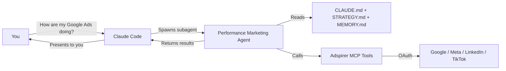

Your AI advertising manager inside the terminal. The performance marketing agent runs as a Claude Code subagent — it has its own prompt, memory, and tools, and returns results back to your main session.

## How It Works

Claude Code uses an **agentic loop**: you describe a task, it reasons about what to do, calls tools, reads results, reasons again, and repeats until done. When your task involves advertising, Claude Code spawns the Adspirer agent to handle it.



### What Happens When You Ask About Ads

You say: *"Create a Google Search campaign for my SaaS product"*

1. Claude Code recognizes this as an advertising task
2. Spawns the performance marketing agent as a subagent
3. Agent reads `CLAUDE.md` (brand context), `STRATEGY.md` (directives), `MEMORY.md` (past decisions)
4. Follows the skill workflow: connection check → competitive research → keyword research → asset validation → campaign creation → ad extensions → verification
5. Each step calls Adspirer MCP tools (`research_keywords`, `create_search_campaign`, etc.)
6. Agent asks for your confirmation before spending
7. Results return to your main Claude Code session

<Tip>
The agent runs as a subagent with its own context — long advertising workflows don't bloat your main session.
</Tip>

---

## What Gets Installed

The Adspirer plugin gives Claude Code everything it needs:

| Component | File | Purpose |
|-----------|------|---------|
| **MCP Server** | `https://mcp.adspirer.com/mcp` | 100+ advertising tools via OAuth |
| **Agent** | `~/.claude/agents/performance-marketing-agent.md` | Agent prompt with brand awareness and workflows |
| **Skill** | `~/.claude/skills/ad-campaign-management/SKILL.md` | Proven workflows for all platforms |
| **Commands** | `~/.claude/commands/*.md` | 5 slash commands for common tasks |

<Tabs>
  <Tab title="Plugin Install (Recommended)">
    ```bash
    /plugin install adspirer-ads-agent@claude-plugins-official
    ```
    Available on the official Anthropic marketplace — no custom marketplace setup needed. Or type `/plugin`, open the **Discover** tab, and search `adspirer`. Installs everything in one step. Run `/reload-plugins` after installing.
  </Tab>
  <Tab title="Manual Install">
    ```bash
    claude mcp add --transport http adspirer https://mcp.adspirer.com/mcp
    git clone https://github.com/amekala/ads-mcp.git /tmp/ads-mcp
    cp -r /tmp/ads-mcp/skills/ad-campaign-management ~/.claude/skills/
    cp -r /tmp/ads-mcp/agents/performance-marketing-agent.md ~/.claude/agents/
    cp /tmp/ads-mcp/commands/*.md ~/.claude/commands/
    ```
  </Tab>
</Tabs>

---

## Skills & Slash Commands

Skills are instruction files that teach Claude Code the *right* workflow for using Adspirer's 100+ tools. Without skills, the AI guesses which tools to call and in what order. With skills, it follows proven advertising workflows with safety rules baked in.

### How Skills Load

1. **Skill descriptions** are always in context — Claude Code knows what's available
2. **Full skill content** loads when invoked (by you or automatically)
3. **The agent preloads the skill** when spawned, so it starts with complete workflow instructions

### One Comprehensive Skill

Claude Code uses **1 skill** (`ad-campaign-management`) covering all platforms and workflows. This differs from Cursor and Codex which split into 5 separate skills — Claude Code consolidates because its plugin system handles slash commands separately.

The skill includes:

- Workflow routing: maps your request to the right tool sequence
- Platform-specific campaign creation flows (Google, Meta, LinkedIn, TikTok)
- Keyword research with strategy directive filtering
- Cross-platform performance analysis
- Budget optimization and wasted spend detection
- Ad extension workflows (sitelinks, callouts, structured snippets)
- Competitive intelligence using web research
- Safety rules: confirmation gates, PAUSED creation, read-before-write

### Slash Commands

| Command | What It Does |
|---------|-------------|
| `/adspirer:setup` | Bootstrap a brand workspace — connect accounts, scan docs, pull data |
| `/adspirer:ad-campaign-management` | Full campaign management — all platforms, all workflows |
| `/adspirer:performance-review` | Cross-platform performance scorecard |
| `/adspirer:write-ad-copy` | Brand-voice ad copy from real performance data |
| `/adspirer:wasted-spend` | Find and fix wasted ad spend |

You don't need to memorize these. Just describe what you want — Claude Code matches the right skill automatically.

<Prompt description="Cross-platform performance review with strategy alignment." actions={["copy"]}>
Run a performance review for the last 30 days across all platforms. Compare against my KPI targets and flag any campaigns that conflict with my strategy.
</Prompt>

<Card
  title="Sign up for Adspirer — free to start"
  icon="rocket"
  href="https://adspirer.ai/sign-up?utm_source=docs&utm_medium=agent-cta&utm_content=claude-code-agent"
  horizontal
>
  15 free tool calls/month. No credit card required. Connect your ad accounts in 2 minutes.
</Card>

---

## Context Files

The agent uses three persistent files to maintain brand awareness across sessions.

### CLAUDE.md — Brand Context

Created by `/adspirer:setup`. Claude Code reads this automatically at session start.

| Section | What It Contains |
|---------|-----------------|
| Brand Overview | What you sell, who you sell to, industry |
| Brand Voice | Tone, language style, prohibited words |
| Target Audiences | Segments with platform-specific targeting |
| Active Platforms | Connected platforms and campaign counts |
| Budget & Guardrails | Monthly budget, CPC caps, CPA targets, ROAS minimums |
| KPI Targets | Primary goals and target metrics |
| Performance Snapshot | Last 30 days across all platforms |
| Key Findings | Top campaigns, wasted spend, opportunities |

### STRATEGY.md — Strategic Decisions

Persists directives across sessions. Every skill reads this before executing.

```markdown
### Google Ads
AVOID: broad match "plumbing services" — competitor-dominated, $12+ CPC
PREFER: exact match "emergency plumber [city]" — high intent, $4-6 CPC
CONSTRAINT: max CPC $8 for non-brand terms — budget protection
```

Directives are **only saved after you explicitly confirm them.** The agent proposes, you approve.

### MEMORY.md — Past Decisions

Tracks campaign actions, optimization results, your preferences, and key learnings. The agent reads memory at session start and cross-references it during analysis.

---

## The Agent Loop: Step by Step

Here's exactly what happens when you run `/adspirer:performance-review`:

<Steps>
  <Step title="Agent spawns">
    Claude Code creates a subagent with the performance marketing agent prompt and skill preloaded.
  </Step>
  <Step title="Context loads">
    Agent reads `CLAUDE.md`, `STRATEGY.md`, and `MEMORY.md`.
  </Step>
  <Step title="Connections check">
    Calls `get_connections_status` to identify which ad platforms are active.
  </Step>
  <Step title="Data pull">
    For each connected platform, calls performance and wasted spend tools in parallel.
  </Step>
  <Step title="Strategy check">
    Compares campaign data against `STRATEGY.md` directives. Flags "Strategy Drift" items.
  </Step>
  <Step title="Analysis & recommendations">
    Compares actuals vs KPI targets. Cross-references with `MEMORY.md`. Presents a unified scorecard with top 3 recommended actions.
  </Step>
</Steps>

---

## Web Research

The Claude Code agent has access to `WebSearch` and `WebFetch` — it can research competitors, crawl websites, and gather market intelligence. This powers the **Campaign Research** workflow that runs before any campaign creation:

1. `WebFetch` crawls your website and competitor sites for positioning, pricing, value propositions
2. `WebSearch` finds competitors, comparison content, and market data
3. Combined with Adspirer data (search terms, keyword volumes), the agent creates a research brief before building your campaign

The agent doesn't just create campaigns from your prompt — it researches your market first.

---

## Safety Rules

| Rule | How It Works |
|------|-------------|
| User confirmation for spend | Agent always asks before creating campaigns or changing budgets |
| Campaigns created PAUSED | All `create_*` tools default to PAUSED status |
| Read-before-write | Connection check → research → validate → create |
| Never retry on error | Reports the error instead of retrying campaign creation |
| Budget guardrails | Checks `CLAUDE.md` budget limits before spend-affecting actions |
| Strategy compliance | Reads `STRATEGY.md` and flags conflicts with active directives |
| Post-creation verification | Verifies ad groups, keywords, ads, and extensions after creation |

---

## Comparison with Other Clients

| Feature | Claude Code | Cursor | Codex |
|---------|:-----------:|:------:|:-----:|
| Agent type | Subagent | Subagent | Agent config |
| Brand context file | `CLAUDE.md` | `BRAND.md` | `AGENTS.md` |
| Skills | 1 comprehensive | 5 separate | 5 separate |
| Slash commands | 5 (`/adspirer:*`) | 5 (`/adspirer-*`) | 5 (`$adspirer-*`) |
| Memory | `MEMORY.md` | `MEMORY.md` | Not available |
| Rules | -- | 2 rule files | Safety rules |
| Web research | `WebSearch` + `WebFetch` | `WebSearch` + `WebFetch` | Not available |

---

## FAQ

<AccordionGroup>
  <Accordion title="How is the agent different from just using MCP tools?">
    Without the agent, you have 100+ tools but no workflow guidance, no brand awareness, no strategy persistence, and no memory. The agent turns raw tools into a managed advertising system that knows your brand and follows proven workflows.
  </Accordion>
  <Accordion title="Can I customize the agent prompt?">
    Yes. Edit `~/.claude/agents/performance-marketing-agent.md` to change behaviors, add workflows, or modify interaction style. The source is in the [ads-mcp repo](https://github.com/amekala/ads-mcp/tree/main/agents).
  </Accordion>
  <Accordion title="Does the agent use my main context window?">
    No. The agent runs as a subagent with its own context. Results are summarized and returned. Long advertising workflows don't bloat your main session.
  </Accordion>
  <Accordion title="Can I run the agent in the background?">
    Yes. Claude Code supports background agents. Spawn the agent for a long task (like a full cross-platform review) and continue working while it runs.
  </Accordion>
  <Accordion title="What model does the agent use?">
    The agent uses the same model as your Claude Code session. You can override this in the agent file with the `model` field.
  </Accordion>
</AccordionGroup>

## Related Documentation

- [Cursor Agent](/agent-skills/cursor-agent) — How Adspirer works in Cursor
- [Codex Agent](/agent-skills/codex-agent) — How Adspirer works in Codex
- [Performance Marketing Agent](/agent-skills/agent) — Architecture overview
- [Skill Reference](/agent-skills/skills) — All 5 skills with invocation details
- [Claude Code Setup](/ai-clients/claude-code) — Installation guide
