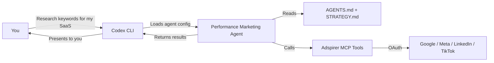

Your AI advertising manager in Codex CLI. The performance marketing agent runs as a **Codex agent config** with 5 dedicated skills and safety rules that prevent direct API calls to ad platforms.

## How It Works

Codex CLI uses a **plan-execute-verify loop**: it explains its plan, you approve, it executes, then verifies results. When your task involves advertising, Codex loads the Adspirer agent config and skills to follow proven workflows.



### What Makes Codex Different

Codex has some unique characteristics compared to Claude Code and Cursor:

1. **AGENTS.md** — Codex uses `AGENTS.md` (not `CLAUDE.md` or `BRAND.md`) for persistent context
2. **No memory file** — Codex doesn't support cross-session memory like Claude Code and Cursor
3. **No web research** — `WebSearch` and `WebFetch` are not available, so competitive research is done through ad platform data only
4. **Safety rules** — `.rules` files that block direct API calls to ad platforms, ensuring everything goes through Adspirer's authenticated pipeline
5. **Dollar-sign commands** — Skills are invoked with `$adspirer-*` syntax

---

## What Gets Installed

The one-command installer sets up everything:

| Component | File | Purpose |
|-----------|------|---------|
| **MCP Server** | `~/.codex/config.toml` | 100+ advertising tools via OAuth |
| **Agent config** | `~/.codex/agents/performance-marketing-agent.toml` | Agent prompt and behavior |
| **5 Skills** | `~/.agents/skills/adspirer-*/SKILL.md` | Workflow instructions per task type |
| **Safety rules** | `rules/campaign-safety.rules` | Block direct ad platform API calls |

<Tabs>
  <Tab title="One-Command Install (Recommended)">
    ```bash
    bash <(curl -fsSL https://raw.githubusercontent.com/amekala/ads-mcp/main/plugins/codex/adspirer/install.sh)
    ```

    Installs MCP server, agent config, all 5 skills, and safety rules. Restart Codex after installing.
  </Tab>
  <Tab title="Manual Install">
    ```bash
    # Add MCP server
    codex mcp add adspirer --url https://mcp.adspirer.com/mcp

    # Clone and install skills + agent
    git clone https://github.com/amekala/ads-mcp.git /tmp/ads-mcp
    mkdir -p ~/.agents/skills
    cp -r /tmp/ads-mcp/plugins/codex/adspirer/skills/adspirer-ads ~/.agents/skills/
    cp -r /tmp/ads-mcp/plugins/codex/adspirer/skills/adspirer-setup ~/.agents/skills/
    cp -r /tmp/ads-mcp/plugins/codex/adspirer/skills/adspirer-performance-review ~/.agents/skills/
    cp -r /tmp/ads-mcp/plugins/codex/adspirer/skills/adspirer-write-ad-copy ~/.agents/skills/
    cp -r /tmp/ads-mcp/plugins/codex/adspirer/skills/adspirer-wasted-spend ~/.agents/skills/
    ```
  </Tab>
</Tabs>

---

## The 5 Skills

Codex uses the same **Agent Skills** standard as Claude Code. Each skill is a `SKILL.md` file with YAML frontmatter and workflow instructions.

| Skill | Command | What It Does |
|-------|---------|-------------|
| **Ad Campaign Management** | `$adspirer-ads` | Full campaign management — all platforms, all workflows |
| **Setup** | `$adspirer-setup` | Bootstrap a brand workspace |
| **Performance Review** | `$adspirer-performance-review` | Cross-platform performance scorecard |
| **Write Ad Copy** | `$adspirer-write-ad-copy` | Brand-voice ad copy from real data |
| **Wasted Spend** | `$adspirer-wasted-spend` | Find and fix wasted ad spend |

### How Skills Work in Codex

1. Codex discovers skills from `~/.agents/skills/` automatically
2. **Progressive disclosure**: metadata loads first, full `SKILL.md` loads when the skill is needed
3. Invoke explicitly with `$adspirer-*` or let Codex match automatically from your description
4. Skills use generic verbs ("Search", "Crawl") instead of tool-specific names since Codex doesn't have `WebSearch`/`WebFetch`

<Prompt description="Run a performance review across all connected platforms." actions={["copy"]}>
$adspirer-performance-review Run a performance review for the last 30 days across all platforms. Compare against my KPI targets and flag any strategy drift.
</Prompt>

<Card
  title="Sign up for Adspirer — free to start"
  icon="rocket"
  href="https://adspirer.ai/sign-up?utm_source=docs&utm_medium=agent-cta&utm_content=codex-agent"
  horizontal
>
  15 free tool calls/month. No credit card required. Connect your ad accounts in 2 minutes.
</Card>

### Codex-Specific Adaptations

The Codex versions of Adspirer skills are adapted from the same source templates as Claude Code and Cursor, with these differences:

| Feature | Claude Code / Cursor | Codex |
|---------|---------------------|-------|
| Context file | `CLAUDE.md` / `BRAND.md` | `AGENTS.md` |
| Web research | `WebFetch` / `WebSearch` | Not available — uses ad platform data only |
| Memory | `MEMORY.md` | Not available |
| Auth troubleshooting | Reconnect via settings | `codex mcp login adspirer` |

---

## Safety Rules

Codex uses `.rules` files to enforce safety at a deeper level than skills. The `campaign-safety.rules` file blocks direct API calls to ad platforms:

```
prefix_rule(
    pattern = ["curl", "https://ads.google.com"],
    decision = "forbidden",
    justification = "Google Ads API calls must go through Adspirer MCP"
)
```

This ensures all ad platform operations go through Adspirer's authenticated, auditable pipeline — never through raw API calls or `curl` commands.

### Full Safety Stack

| Rule | How It Works |
|------|-------------|
| User confirmation for spend | Agent asks before creating campaigns or changing budgets |
| Campaigns created PAUSED | All `create_*` tools default to PAUSED status |
| Read-before-write | Connection check → research → validate → create |
| Never retry on error | Reports errors instead of retrying campaign creation |
| Direct API blocked | `.rules` files block `curl` to ad platform APIs |
| Post-creation verification | Verifies ad groups, keywords, ads after creation |
| Build integrity check | Flags campaigns with zero ads or zero keywords before optimization |

---

## Context Files

Codex uses two persistent files (no memory file).

### AGENTS.md — Brand Context

Created by `$adspirer-setup`. This is Codex's equivalent of `CLAUDE.md` (Claude Code) and `BRAND.md` (Cursor).

Codex uses a hierarchical `AGENTS.md` loading system:
1. **Global:** `~/.codex/AGENTS.md` (applies to all projects)
2. **Project:** Walks from git root to current directory, merging each level
3. Maximum combined size: 32 KiB

| Section | What It Contains |
|---------|-----------------|
| Brand Overview | What you sell, who you sell to, industry |
| Brand Voice | Tone, language style, prohibited words |
| Active Platforms | Connected platforms and campaign counts |
| Budget & Guardrails | Monthly budget, CPC caps, CPA targets |
| Performance Snapshot | Last 30 days from Adspirer |

### STRATEGY.md — Strategic Decisions

Same as Claude Code and Cursor. Persists directives across sessions:

```markdown
### Google Ads
AVOID: broad match "plumbing services" — competitor-dominated, $12+ CPC
PREFER: exact match "emergency plumber [city]" — high intent, $4-6 CPC
```

<Note>
Since Codex doesn't have a memory file, `STRATEGY.md` and `AGENTS.md` are the primary ways to persist context across sessions. Put anything you want the agent to remember in these files.
</Note>

---

## The Agent Loop

When you invoke `$adspirer-performance-review` in Codex:

<Steps>
  <Step title="Skill loads">
    Codex discovers and loads the performance review skill via progressive disclosure.
  </Step>
  <Step title="Context loads">
    Reads `AGENTS.md` for brand context and KPI targets. Reads `STRATEGY.md` for active directives.
  </Step>
  <Step title="Connections check">
    Calls `get_connections_status` to identify connected ad platforms.
  </Step>
  <Step title="Data pull">
    For each connected platform, calls performance tools via Adspirer MCP.
  </Step>
  <Step title="Strategy check">
    Compares campaign data against `STRATEGY.md`. Flags "Strategy Drift" items.
  </Step>
  <Step title="Results">
    Presents a unified scorecard with recommendations and top 3 actions.
  </Step>
</Steps>

---

## Approval Modes

Codex has 3 approval modes that affect how the agent interacts:

| Mode | File Access | Tool Calls | Best For |
|------|------------|------------|----------|
| **Read-only** | Read only | Approval needed | Reviewing performance, auditing spend |
| **Auto** (default) | Read + edit in working dir | Auto-approved in scope | Campaign creation, keyword management |
| **Full Access** | Read anywhere + network | Auto-approved | Bulk operations across accounts |

For advertising tasks, **Auto mode** works well — you get automatic approvals for read operations and prompted for spend-affecting actions.

---

## Comparison with Other Clients

| Feature | Codex | Claude Code | Cursor |
|---------|:-----:|:-----------:|:------:|
| Agent type | Agent config | Subagent | Subagent |
| Brand context file | `AGENTS.md` | `CLAUDE.md` | `BRAND.md` |
| Skills | 5 separate | 1 comprehensive | 5 separate |
| Commands | `$adspirer-*` | `/adspirer:*` | `/adspirer-*` |
| Memory | Not available | `MEMORY.md` | `MEMORY.md` |
| Rules | Safety rules (`.rules`) | -- | Cursor Rules (`.mdc`) |
| Web research | Not available | `WebSearch` + `WebFetch` | `WebSearch` + `WebFetch` |
| Direct API blocking | Yes (`.rules`) | No | No |

---

## FAQ

<AccordionGroup>
  <Accordion title="Why doesn't Codex have memory?">
    Codex CLI doesn't support a persistent memory file like Claude Code's `MEMORY.md`. Use `AGENTS.md` and `STRATEGY.md` to persist important context. The agent will record decisions and findings in `STRATEGY.md` when you confirm them.
  </Accordion>
  <Accordion title="Can the agent do competitive research without WebSearch?">
    The Codex agent can't crawl websites or search the web. It relies on Adspirer's ad platform data (search terms, keyword volumes, campaign performance, benchmarks) for insights. For competitive research, use Claude Code or Cursor instead.
  </Accordion>
  <Accordion title="What are safety rules?">
    Codex `.rules` files block specific command patterns. Adspirer's `campaign-safety.rules` prevents direct `curl` or API calls to Google Ads, Meta, LinkedIn, and TikTok APIs. This ensures all operations go through Adspirer's authenticated pipeline with proper OAuth, audit logging, and safety checks.
  </Accordion>
  <Accordion title="Can I use Codex as an MCP server for other agents?">
    Yes. Codex CLI can expose itself as an MCP server for the OpenAI Agents SDK. This means you can build higher-level agents that delegate advertising tasks to Codex + Adspirer. See the [Codex Agents SDK guide](https://developers.openai.com/codex/guides/agents-sdk/).
  </Accordion>
</AccordionGroup>

## Related Documentation

- [Claude Code Agent](/agent-skills/claude-code-agent) — How Adspirer works in Claude Code
- [Cursor Agent](/agent-skills/cursor-agent) — How Adspirer works in Cursor
- [Performance Marketing Agent](/agent-skills/agent) — Architecture overview
- [Skill Reference](/agent-skills/skills) — All 5 skills with invocation details
- [Codex Setup](/ai-clients/codex) — Installation guide
