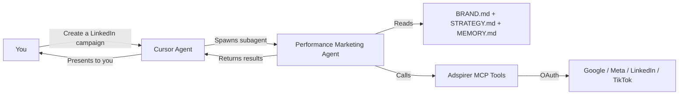

Your AI advertising manager inside Cursor. The performance marketing agent runs as a **Cursor subagent** with 5 dedicated skills and 2 Cursor Rules that auto-trigger the right workflow for every advertising task.

## How It Works

Cursor's agent mode uses an agentic loop: you describe a task, it reasons, calls tools, reads results, and repeats. When your task involves advertising, Cursor can delegate to the Adspirer subagent — which has its own prompt, memory, skills, and MCP tools.



### What Makes Cursor Different

Cursor has two features that no other client offers for Adspirer:

1. **Cursor Rules** (`.mdc` files) — auto-trigger advertising workflows based on context. You don't need to invoke a skill manually. When you mention ad campaigns, the rules kick in automatically.
2. **5 separate skills** — each focused on one workflow. The main skill (`adspirer-ads`) handles all campaigns, while 4 specialized skills handle setup, performance review, ad copy, and wasted spend.

---

## What Gets Installed

The one-command installer sets up everything:

| Component | File | Purpose |
|-----------|------|---------|
| **MCP Server** | `~/.cursor/mcp.json` | 100+ advertising tools via OAuth |
| **Subagent** | `.cursor/agents/performance-marketing-agent.md` | Agent prompt with brand awareness |
| **5 Skills** | `.cursor/skills/adspirer-*/SKILL.md` | Workflow instructions per task type |
| **2 Rules** | `.cursor/rules/*.mdc` | Auto-trigger advertising workflows |

<Tabs>
  <Tab title="One-Command Install (Recommended)">
    Run from your **system terminal**, not Cursor's built-in terminal:

    ```bash
    bash <(curl -fsSL https://raw.githubusercontent.com/amekala/ads-mcp/main/plugins/cursor/adspirer/install.sh)
    ```

    Installs MCP server, subagent, all 5 skills, and Cursor Rules. Restart Cursor after installing.
  </Tab>
  <Tab title="Manual Install">
    ```bash
    # Add MCP server
    echo '{"mcpServers":{"adspirer":{"url":"https://mcp.adspirer.com/mcp"}}}' > ~/.cursor/mcp.json

    # Clone and install skills + agent + rules
    git clone https://github.com/amekala/ads-mcp.git /tmp/ads-mcp
    cp -r /tmp/ads-mcp/plugins/cursor/adspirer/.cursor/skills ~/.cursor/
    cp -r /tmp/ads-mcp/plugins/cursor/adspirer/.cursor/agents ~/.cursor/
    cp -r /tmp/ads-mcp/plugins/cursor/adspirer/.cursor/rules ~/.cursor/
    ```
  </Tab>
</Tabs>

---

## The 5 Skills

Cursor uses **5 separate skills**, each focused on one workflow. This maps to Cursor's skill architecture where each skill has its own invocation command.

| Skill | Command | What It Does |
|-------|---------|-------------|
| **Ad Campaign Management** | `/adspirer-ads` | Full campaign management — all platforms, all workflows |
| **Setup** | `/adspirer-setup` | Bootstrap a brand workspace |
| **Performance Review** | `/adspirer-performance-review` | Cross-platform performance scorecard |
| **Write Ad Copy** | `/adspirer-write-ad-copy` | Brand-voice ad copy from real data |
| **Wasted Spend** | `/adspirer-wasted-spend` | Find and fix wasted ad spend |

### How Skills Work in Cursor

1. **Skill descriptions** are always in context — Cursor knows what's available
2. **Full skill content** loads when you invoke it or Cursor matches it automatically
3. Each skill is a `SKILL.md` file in `.cursor/skills/adspirer-*/`
4. You can invoke directly with `/adspirer-*` or just describe what you want

<Prompt description="Cross-platform wasted spend audit with savings estimate." actions={["copy"]}>
Find wasted spend across all my platforms. Show me which keywords have spend but zero conversions, which Meta ads are fatigued, and how much I could save per month.
</Prompt>

<Card
  title="Sign up for Adspirer — free to start"
  icon="rocket"
  href="https://adspirer.ai/sign-up?utm_source=docs&utm_medium=agent-cta&utm_content=cursor-agent"
  horizontal
>
  15 free tool calls/month. No credit card required. Connect your ad accounts in 2 minutes.
</Card>

### Main Skill: adspirer-ads

The comprehensive skill covering all platforms and workflows:

- Campaign creation flows for Google Search, PMax, Meta, LinkedIn, TikTok
- Keyword research with strategy directive filtering
- Cross-platform performance dashboards
- Budget optimization and wasted spend analysis
- Ad extension workflows (sitelinks, callouts, structured snippets)
- Competitive intelligence via web research
- Audience analysis and optimization
- Monitoring and scheduled reporting

### Specialized Skills

The 4 smaller skills focus on specific workflows:

| Skill | Steps It Follows |
|-------|-----------------|
| **Setup** | Check MCP → Scan folder → Pull live data → Create `BRAND.md` + `STRATEGY.md` → Present summary |
| **Performance Review** | Read context → Read strategy → Pull all platform data → Pull wasted spend → Unified scorecard → Top 3 actions |
| **Write Ad Copy** | Read brand voice → Read strategy → Pull campaign structure → Analyze search terms → AI suggestions → Filter through brand rules → Present options |
| **Wasted Spend** | Check connections → Read strategy → Analyze waste per platform → Budget reallocation → Recommend fixes |

---

## Cursor Rules

Cursor Rules are `.mdc` files that auto-trigger behavior. Adspirer ships 2 rules:

### brand-workspace.mdc

Auto-loads brand context on every advertising task:

- Reads `BRAND.md` and `MEMORY.md` at session start
- Reads `STRATEGY.md` for active directives
- Bootstraps new workspaces if `BRAND.md` doesn't exist
- Updates context files when significant changes happen

### use-adspirer.mdc

Enforces workflow safety automatically:

- Always checks connections first
- Read-before-write enforcement
- User confirmation before spend-affecting actions
- Campaign creation in PAUSED status
- Strategy directive checks before campaign creation
- Mandatory ad extensions for Google Ads campaigns
- Post-creation verification before reporting success

### Rules vs Skills

| | Rules | Skills |
|--|-------|--------|
| **Trigger** | Automatically based on context | Manually via `/command` or AI-matched |
| **Purpose** | Safety enforcement, context loading | Workflow instructions, tool sequences |
| **Format** | `.mdc` files with `alwaysApply: true` | `SKILL.md` files with frontmatter |
| **What they do** | "Always check connections first" | "To create a campaign, follow these 12 steps" |

Rules and skills work together. The rule ensures safety; the skill provides the detailed workflow.

<Note>
Without rules, you say "create a Google Ads campaign" and Cursor might jump straight to `create_search_campaign` — which fails because there's no keyword research, no asset validation, no strategy check.

With rules, the same prompt triggers the full workflow automatically: connection check → strategy load → keyword research → asset validation → confirmation → creation → extensions → verification.
</Note>

---

## Context Files

The agent uses three persistent files. Cursor's file is `BRAND.md` (vs Claude Code's `CLAUDE.md`).

### BRAND.md — Brand Context

Created by `/adspirer-setup`. Contains brand overview, voice, audiences, connected platforms, budgets, KPI targets, and performance snapshot.

| Section | Source |
|---------|--------|
| Brand Overview | Your docs + Adspirer data |
| Brand Voice | Your docs (tone, style, prohibited words) |
| Active Platforms | `get_connections_status` |
| Budget & Guardrails | Your docs + campaign data |
| Performance Snapshot | Last 30 days from Adspirer |

### STRATEGY.md — Strategic Decisions

Same as Claude Code. Persists directives across sessions:

```markdown
### Google Ads
AVOID: broad match "plumbing services" — competitor-dominated, $12+ CPC
PREFER: exact match "emergency plumber [city]" — high intent, $4-6 CPC
```

### MEMORY.md — Past Decisions

Located at `.cursor/memory/performance-marketing-agent/MEMORY.md`. Tracks campaign actions, optimization results, and learnings.

---

## The Agent Loop

When you invoke `/adspirer-performance-review` in Cursor:

<Steps>
  <Step title="Rule activates">
    `brand-workspace.mdc` fires, loading `BRAND.md` and `STRATEGY.md` into context.
  </Step>
  <Step title="Skill loads">
    Cursor matches the performance review skill and loads its full workflow instructions.
  </Step>
  <Step title="Agent spawns">
    The performance marketing subagent starts with brand context, strategy, and memory.
  </Step>
  <Step title="Data pull">
    For each connected platform, calls performance and wasted spend tools via Adspirer MCP.
  </Step>
  <Step title="Strategy check">
    Compares campaign data against `STRATEGY.md`. Flags "Strategy Drift" items.
  </Step>
  <Step title="Results">
    Presents a unified scorecard with recommendations and top 3 actions.
  </Step>
</Steps>

---

## Web Research

Cursor's agent has access to `WebSearch` and `WebFetch` for competitive research. Before creating any campaign, the agent:

1. Crawls your website for positioning, pricing, and value propositions
2. Searches for and crawls competitor websites
3. Combines web data with Adspirer data (search terms, keyword volumes)
4. Presents a research brief before building your campaign

---

## Safety Rules

| Rule | How It Works |
|------|-------------|
| User confirmation for spend | Agent always asks before creating campaigns or changing budgets |
| Campaigns created PAUSED | All `create_*` tools default to PAUSED status |
| Read-before-write | Connection check → research → validate → create |
| Never retry on error | Reports the error instead of retrying |
| Budget guardrails | Checks `BRAND.md` budget limits before spend-affecting actions |
| Strategy compliance | Reads `STRATEGY.md` and flags conflicts |
| Post-creation verification | Verifies ad groups, keywords, ads, and extensions |
| Cursor Rules enforcement | `use-adspirer.mdc` auto-triggers safety checks |

---

## Comparison with Other Clients

| Feature | Cursor | Claude Code | Codex |
|---------|:------:|:-----------:|:-----:|
| Agent type | Subagent | Subagent | Agent config |
| Brand context file | `BRAND.md` | `CLAUDE.md` | `AGENTS.md` |
| Skills | 5 separate | 1 comprehensive | 5 separate |
| Commands | `/adspirer-*` | `/adspirer:*` | `$adspirer-*` |
| Memory | `MEMORY.md` | `MEMORY.md` | Not available |
| Rules (auto-trigger) | 2 rule files | -- | Safety rules |
| Web research | `WebSearch` + `WebFetch` | `WebSearch` + `WebFetch` | Not available |

---

## FAQ

<AccordionGroup>
  <Accordion title="Do I need Cursor Rules to use Adspirer?">
    No, but they make everything smoother. Without rules, you need to be more explicit ("first check my connections, then research keywords"). With rules, safety checks and context loading happen automatically.
  </Accordion>
  <Accordion title="Can I edit the rules and skills?">
    Yes. Rules are `.mdc` files in `.cursor/rules/`. Skills are `SKILL.md` files in `.cursor/skills/`. Edit them to change default behaviors, add custom workflows, or modify safety rules.
  </Accordion>
  <Accordion title="What's the difference between the subagent and Composer?">
    Cursor's Composer is the main agent mode for coding tasks. The Adspirer subagent is a specialized agent that Composer can delegate to when advertising tasks come up. The subagent has its own context, so ad workflows don't bloat your coding session.
  </Accordion>
  <Accordion title="Can I use Adspirer in Cursor without the agent?">
    Yes. Just add the MCP server and you get 100+ tools directly. But without the agent, skills, and rules, you lose brand awareness, workflow enforcement, strategy persistence, and memory.
  </Accordion>
</AccordionGroup>

## Related Documentation

- [Claude Code Agent](/agent-skills/claude-code-agent) — How Adspirer works in Claude Code
- [Codex Agent](/agent-skills/codex-agent) — How Adspirer works in Codex
- [Performance Marketing Agent](/agent-skills/agent) — Architecture overview
- [Skill Reference](/agent-skills/skills) — All 5 skills with invocation details
- [Cursor Setup](/ai-clients/cursor) — Installation guide
