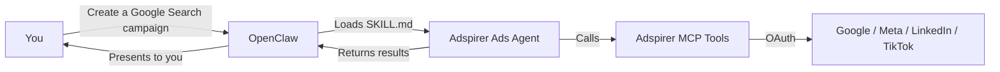

Your AI advertising manager in OpenClaw. The Adspirer plugin ships a **14KB SKILL.md** instruction file that turns OpenClaw into a specialized advertising agent — pre-configured, pre-trained, ready to run campaigns.

## How It Works

OpenClaw discovers the SKILL.md file bundled with the plugin and loads it when your request matches advertising keywords. The skill file teaches OpenClaw the right tool sequences, safety rules, and platform-specific nuances.



### What Makes OpenClaw Different

OpenClaw has some unique characteristics compared to Claude Code, Cursor, and Codex:

1. **Bundled skill** — The 14KB SKILL.md ships inside the plugin. No separate skill or agent installation.
2. **No context files** — OpenClaw doesn't use `CLAUDE.md`, `BRAND.md`, or `AGENTS.md`. It relies on the SKILL.md and your prompts for context.
3. **No memory or strategy** — No `MEMORY.md` or `STRATEGY.md`. Each session starts fresh.
4. **Tool groups** — You can enable/disable entire platforms or cherry-pick individual tools.
5. **claw.json manifest** — Defines plugin metadata, permissions, and network access.

---

## What Gets Installed

One command installs everything:

| Component | File | Purpose |
|-----------|------|---------|
| **MCP Server** | Plugin config | 100+ advertising tools via OAuth |
| **Skill file** | `SKILL.md` (bundled) | Complete workflow instructions for all platforms |
| **Manifest** | `claw.json` | Plugin metadata, permissions, network access |

```bash
openclaw plugins install openclaw-adspirer
```

No separate agent, skill, or rules installation needed. Restart OpenClaw after installing.

<Card
  title="Sign up for Adspirer — free to start"
  icon="rocket"
  href="https://adspirer.ai/sign-up?utm_source=docs&utm_medium=agent-cta&utm_content=openclaw-agent"
  horizontal
>
  15 free tool calls/month. No credit card required. Connect your ad accounts in 2 minutes.
</Card>

---

## The Skill File

Most MCP integrations give you raw tool access. OpenClaw gives you a 14,400-character instruction manual that covers:

- **100+ tools documented** — every parameter, every edge case
- **6 complete workflows** — performance analysis, keyword research, campaign creation (per platform), budget optimization, account management, automation
- **Platform quick reference** — when to use each platform, minimum budgets, best use cases
- **Safety rules** — what to always check first, what requires user confirmation, what never to retry
- **Troubleshooting guide** — common errors and how to fix them

This isn't configuration. It's training. OpenClaw reads the SKILL.md file and knows how to behave like an expert advertising manager.

### How the Skill Loads

1. OpenClaw discovers the SKILL.md from the plugin's `claw.json` manifest (`"entry": "SKILL.md"`)
2. When your request matches advertising keywords (PPC, ad campaign, ROAS, keyword research, etc.), the skill activates
3. OpenClaw follows the workflow instructions in the skill file — not guessing tool order
4. Safety rules from the skill enforce confirmation gates and PAUSED campaign creation

---

## Tool Groups

The plugin organizes tools into platform groups you can enable or disable:

| Group | Platform | Tools |
|-------|----------|:-----:|
| `google_ads` | Google Ads | 39 |
| `meta_ads` | Meta Ads | 20 |
| `linkedin_ads` | LinkedIn Ads | 28 |
| `tiktok_ads` | TikTok Ads | 4 |
| `manus` | Automation | 8 |
| `system` | Cross-Platform | 4 |

### Filtering by Platform

Enable only the platforms you use:

```yaml
config:
  enabledGroups: ["google_ads", "meta_ads"]
```

Or cherry-pick individual tools:

```yaml
config:
  enabledTools: ["get_campaign_performance", "research_keywords", "analyze_wasted_spend"]
```

---

## Example Prompts

<Prompt description="Google Search campaign with keyword research and negative keywords." actions={["copy"]}>
Create a Google Ads search campaign for my consulting firm:
- Service: fractional CFO services for startups
- Target: startup founders and CEOs at Series A-B companies
- Budget: $80/day
- Research keywords with real CPC data
- Add negative keywords for "jobs", "salary", "free"
</Prompt>

<Prompt description="Cross-platform performance report with wasted spend analysis." actions={["copy"]}>
Generate a full performance report for the last 30 days. Pull data from all connected platforms. Include per-platform metrics (spend, conversions, CPA, ROAS), wasted spend analysis, and top 5 recommendations for next month.
</Prompt>

---

## The claw.json Manifest

The plugin includes a manifest that defines metadata and permissions:

```json
{
  "name": "adspirer-ads-agent",
  "version": "1.2.1",
  "displayName": "Adspirer Ads Agent",
  "category": "marketing",
  "entry": "SKILL.md",
  "permissions": {
    "network": ["mcp.adspirer.com", "www.adspirer.com"]
  }
}
```

The `entry` field points to the SKILL.md — this is how OpenClaw knows which file contains the agent's instructions. Network permissions restrict the plugin to Adspirer's servers only.

---

## Safety Rules

The skill file includes safety rules that OpenClaw enforces automatically:

| Rule | How It Works |
|------|-------------|
| User confirmation for spend | Agent asks before creating campaigns or changing budgets |
| Campaigns created PAUSED | All `create_*` tools default to PAUSED status |
| Read-before-write | Connection check → research → validate → create |
| Never retry on error | Reports errors instead of retrying campaign creation |
| Platform minimums enforced | Google/LinkedIn $10/day, Meta no minimum |
| Post-creation verification | Verifies ad groups, keywords, ads after creation |

---

## Comparison with Other Clients

| Feature | OpenClaw | Claude Code | Cursor | Codex |
|---------|:--------:|:-----------:|:------:|:-----:|
| Agent type | Bundled skill | Subagent | Subagent | Agent config |
| Brand context file | None | `CLAUDE.md` | `BRAND.md` | `AGENTS.md` |
| Skills | 1 bundled | 1 comprehensive | 5 separate | 5 separate |
| Memory | Not available | `MEMORY.md` | `MEMORY.md` | Not available |
| Strategy | Not available | `STRATEGY.md` | `STRATEGY.md` | `STRATEGY.md` |
| Web research | Not available | `WebSearch` + `WebFetch` | `WebSearch` + `WebFetch` | Not available |
| Tool filtering | Group + individual | -- | -- | -- |
| Setup | 1 command | Plugin install | Bash installer | Bash installer |

---

## FAQ

<AccordionGroup>
  <Accordion title="What's the difference between OpenClaw and other MCP clients?">
    Other clients give you access to Adspirer's tools and require separate agent/skill installation. OpenClaw bundles everything in one plugin — the SKILL.md instruction file ships inside the plugin itself. Less setup, more intelligence out of the box.
  </Accordion>
  <Accordion title="Can I edit the skill file?">
    Yes. The SKILL.md is in the plugin directory. Edit it to change default behaviors, add custom workflows, or modify safety rules. Changes take effect on the next OpenClaw restart.
  </Accordion>
  <Accordion title="Why doesn't OpenClaw have memory or strategy files?">
    OpenClaw doesn't have a persistent memory system like Claude Code or Cursor. Each session starts fresh. If you need cross-session persistence, use Claude Code or Cursor instead.
  </Accordion>
  <Accordion title="Can I use only Google Ads tools?">
    Yes. Set `enabledGroups: ["google_ads"]` in your config to disable all other platforms. Or use `enabledTools` to cherry-pick specific tools.
  </Accordion>
</AccordionGroup>

## Related Documentation

- [Claude Code Agent](/agent-skills/claude-code-agent) — How Adspirer works in Claude Code
- [Cursor Agent](/agent-skills/cursor-agent) — How Adspirer works in Cursor
- [Codex Agent](/agent-skills/codex-agent) — How Adspirer works in Codex
- [Performance Marketing Agent](/agent-skills/agent) — Architecture overview
- [Skill Reference](/agent-skills/skills) — All 5 skills with invocation details
- [OpenClaw Setup](/ai-clients/openclaw) — Installation guide
