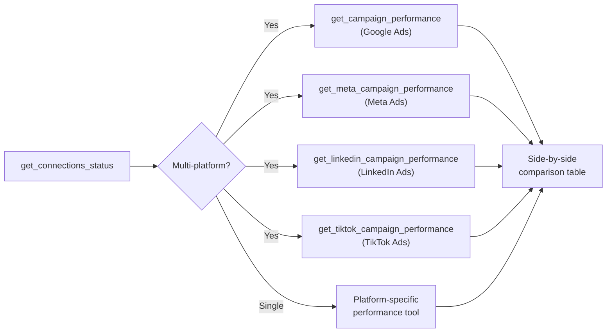
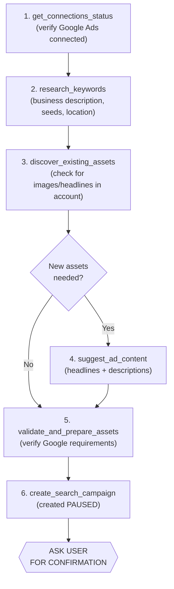
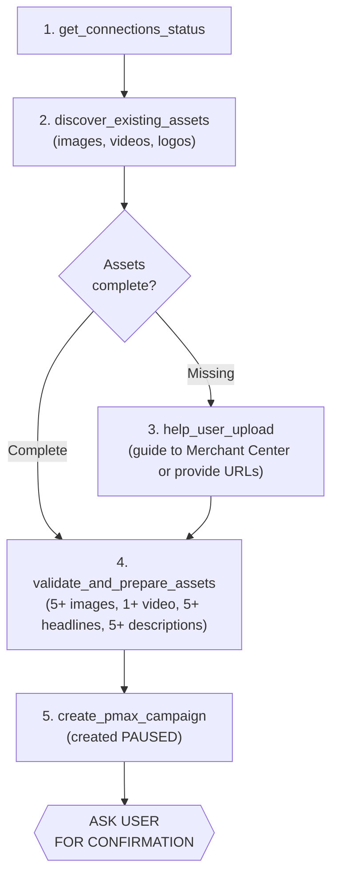
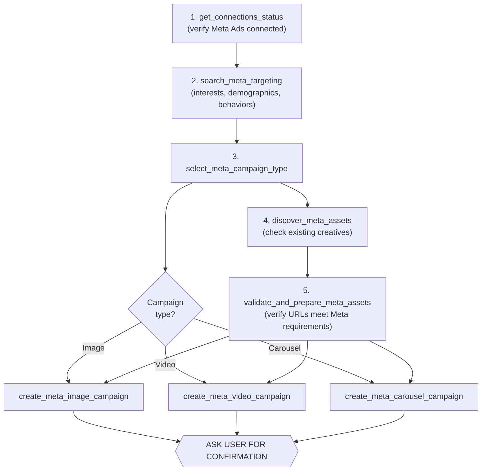
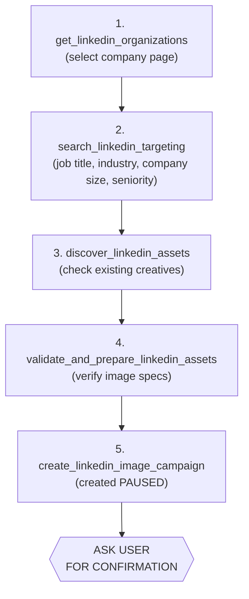
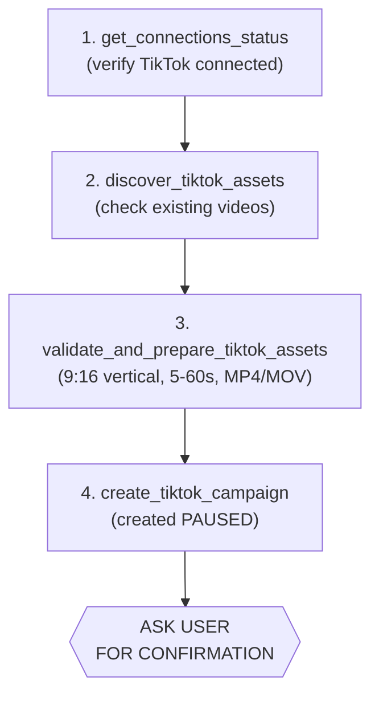
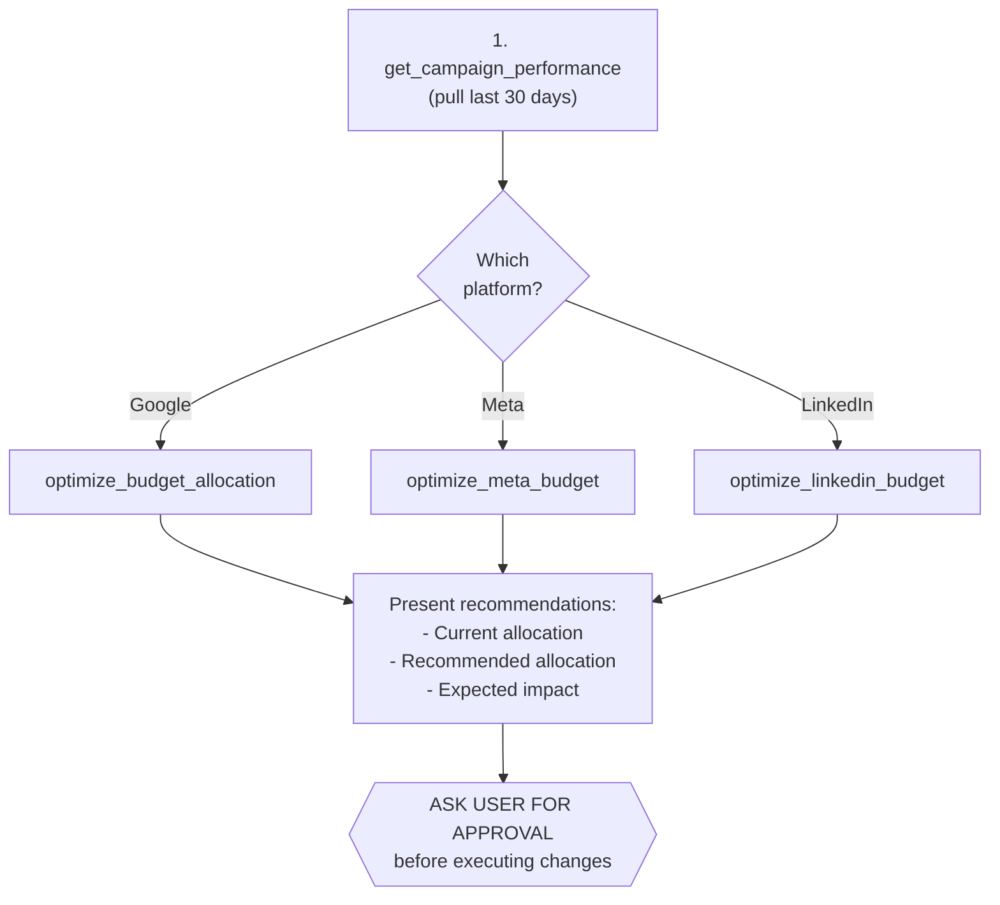
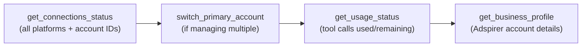

Exact tool sequences for campaign creation, optimization, and analysis. These are the workflows that agent skills enforce automatically.

## 1. Performance Analysis (Cross-Platform)

Pull metrics from all connected ad platforms and present a unified view.

### Workflow



### Output Format

Results should be formatted as a table with columns: Platform, Spend, Conversions, CPA, ROAS, CTR.

### Deep Analysis Tools (Optional)

- `analyze_wasted_spend` (Google) -- Find keywords with spend but no conversions
- `detect_meta_creative_fatigue` (Meta) -- Identify declining ad performance
- `explain_performance_anomaly` (any platform) -- Diagnose sudden CPA spikes or CTR drops

## 2. Google Search Campaign Creation

Five-step workflow. Skip a step = campaign creation fails.

### Workflow



### Key Parameters

- **research_keywords:** business_description, seed_keywords, target_location (e.g., "United States")
- **create_search_campaign:** campaign_name, daily_budget (min $10), asset_bundle, targeting

### Safety Rules

<Warning>
- Never skip keyword research (even if user provides keywords -- validate CPC data)
- Always validate assets before campaign creation
- Campaign is created PAUSED -- user reviews before launching
</Warning>

## 3. Google PMax Campaign Creation

Performance Max campaigns require high-quality assets. Four-step workflow.

### Workflow



### Asset Requirements

- Minimum 5 images (1200x628px landscape + 1200x1200px square)
- Minimum 1 video (under 30 seconds recommended)
- 5 headlines (max 30 chars each)
- 5 descriptions (max 90 chars each)
- 1 logo (1200x1200px)

## 4. Meta Campaign Creation

Six-step workflow for Facebook & Instagram campaigns.

### Workflow



### Creative Requirements by Type

- **Image:** 1080x1080px, JPG/PNG, under 30MB
- **Video:** 1080x1080px, MP4/MOV, under 4GB, 1-240 seconds
- **Carousel:** 2-10 cards, each 1080x1080px

### Safety Rules

<Warning>
- Creative assets must be provided as URLs (Google Drive, Dropbox, S3)
- Validate creative URLs are publicly accessible before campaign creation
- Minimum $5/day budget per ad set
</Warning>

## 5. LinkedIn Campaign Creation

Five-step workflow for B2B sponsored content.

### Workflow



### Targeting Best Practices

<Tip>
- Combine job titles + industries (e.g., "Marketing Manager" + "Computer Software")
- Add seniority filter for decision-makers (Director, VP, C-level)
- Use company size to match your ICP (Ideal Customer Profile)
- Minimum audience size: 300 members (LinkedIn requirement)
</Tip>

### Safety Rules

<Warning>
- Must select organization first (no org = campaign creation fails)
- Minimum $10/day budget
- Image dimensions: 1200x627px or 1200x1200px
</Warning>

## 6. TikTok Campaign Creation

Three-step workflow (simpler than other platforms).

### Workflow



### Creative Requirements

- Vertical video: 9:16 aspect ratio (1080x1920px)
- Duration: 5-60 seconds (9-15 seconds performs best)
- Format: MP4 or MOV
- File size: Under 500MB

## 7. Budget Optimization Workflow

Reallocate spend based on performance data.

### Workflow



### Optimization Logic

- Shift budget from low-ROAS campaigns to high-ROAS campaigns
- Increase spend on campaigns with CPA below target
- Decrease or pause campaigns with CPA 2x+ above target
- Maintain minimum budgets per platform ($10 Google/LinkedIn, $5 Meta)

## 8. Account Management Workflow

Managing multiple ad accounts and checking system status.

### Workflow



### When to Use

- At the start of every session (verify correct account is active)
- Before creating campaigns (confirm you're in the right ad account)
- When switching between client accounts (agencies managing multiple advertisers)

## 9. Automation Workflow

Schedule recurring tasks and set up monitoring.

### Available Automation Tools

- `schedule_brief` -- Schedule daily/weekly performance summaries
- `create_monitor` -- Set alerts for CPA spikes, budget overspend, etc.
- `list_monitors` -- View active monitors
- `generate_report_now` -- Generate ad-hoc cross-platform reports
- `list_scheduled_tasks` -- View all scheduled briefs and reports

### Example: Daily Performance Brief

```python
schedule_brief(
  platforms=["google", "meta", "linkedin"],
  frequency="daily",
  time="08:00 AM",
  metrics=["spend", "conversions", "cpa"],
  delivery_method="email"
)
```

### Example: CPA Spike Monitor

```python
create_monitor(
  platform="google",
  metric="cpa",
  threshold=50,  # alert if CPA goes above $50
  condition="exceeds",
  alert_method="slack"
)
```

## Workflow Principles

These rules apply to ALL workflows:

<Note>
1. **Always start with connections check:** Run `get_connections_status` before platform-specific tools
2. **Read before write:** Research/validate before creating campaigns
3. **User confirmation required:** Ask before any action that affects spend
4. **Campaigns created PAUSED:** User reviews before launching live
5. **Never retry on error:** Report failures, don't auto-retry campaign creation
6. **Format results as tables:** Make data scannable (columns: metric name, value, change vs. previous period)
</Note>

## Related Documentation

- [Tool Catalog](/agent-skills/tools) -- All 100+ tools with parameters
- [Skills Overview](/agent-skills/overview)
- [Google Ads Integration](/ad-platforms/google-ads)
- [Meta Ads Integration](/ad-platforms/meta-ads)
- [LinkedIn Ads Integration](/ad-platforms/linkedin-ads)
- [TikTok Ads Integration](/ad-platforms/tiktok-ads)
