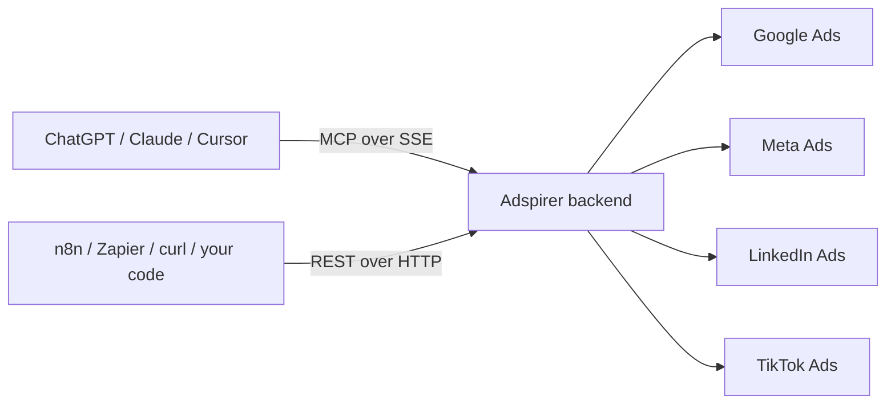
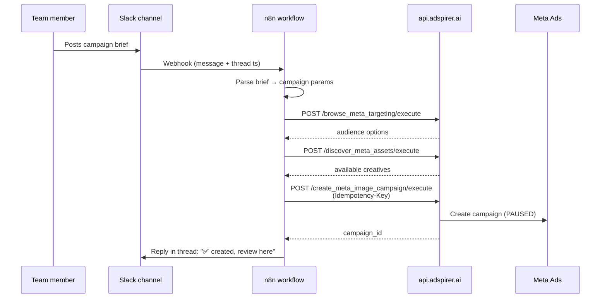
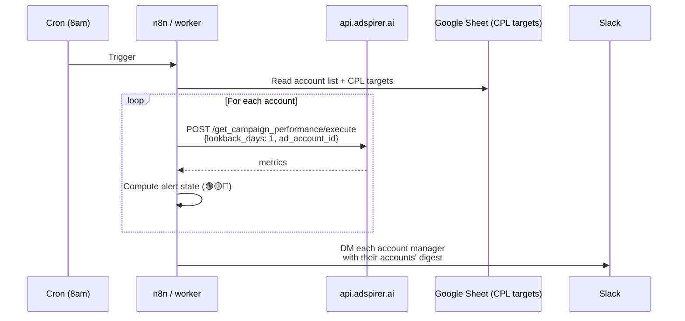
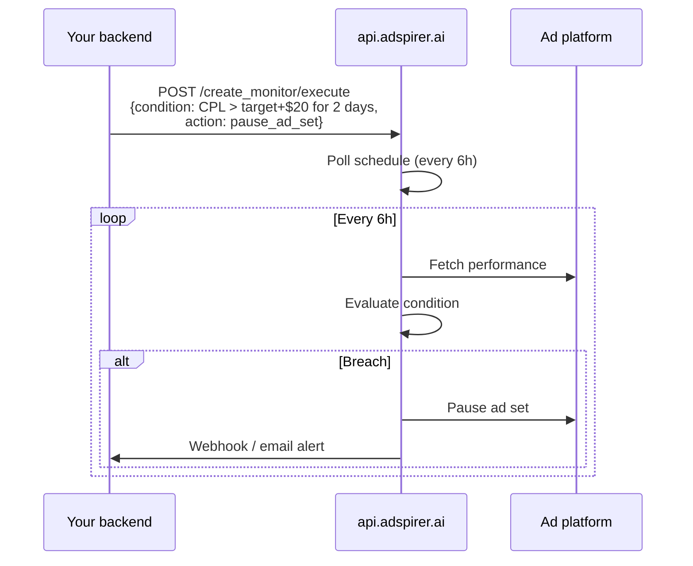

The Adspirer REST API exposes every tool the [MCP server](/mcp) does, over plain HTTP. Use it from any client that can't speak SSE — n8n, Zapier, Make, GitHub Actions, Python scripts, cron jobs, or your own backend.

<Card
  title="Get your API key"
  icon="key"
  href="https://adspirer.ai/keys?utm_source=docs&utm_medium=api-reference&utm_content=intro"
  horizontal
>
  Generate a key at `adspirer.ai/keys`, then call any of the 178 endpoints below with a bearer token. Free tier includes 15 calls — enough to test everything.
</Card>

| | |
| :--- | :--- |
| **Base URL** | `https://api.adspirer.ai` |
| **Interactive sandbox** | [api.adspirer.ai/docs](https://api.adspirer.ai/docs) (Swagger UI) |
| **Raw OpenAPI spec** | [api.adspirer.ai/openapi.json](https://api.adspirer.ai/openapi.json) |

## Use cases

Real patterns teams ship on the REST API today. Each one is just a few HTTP calls — the hard part is already done for you.

<CardGroup cols={2}>
  <Card title="Slack ChatOps for campaigns" icon="slack">
    Team member posts a campaign brief in `#campaign-activation` → n8n parses it → REST API creates the campaign `PAUSED` → bot confirms in the thread. Nobody needs a Meta / Google login.
  </Card>
  <Card title="Daily account briefings" icon="sun">
    Every morning, pull CPL / ROAS / spend for each account manager's book of business and deliver a Slack digest. Alert states (🟢 on-track, 🟡 watch, 🔴 red) computed against targets you store in a Google Sheet.
  </Card>
  <Card title="Portfolio rollups for owners" icon="chart-pie">
    Weekly health summary across every client account — who's over/under target, budget utilization, top / bottom 5 performers, per-manager breakdown.
  </Card>
  <Card title="Alert thresholds & auto-pause" icon="bell">
    Watch CPL vs target, flag breaches, pause underperforming ad sets on a rule. [`create_monitor`](/api-reference/monitoring/create-monitor) handles the poll loop on our side so you don't run a cron.
  </Card>
  <Card title="SaaS product embedding" icon="rocket">
    Your app creates a starter campaign for every new customer during onboarding. `Idempotency-Key` makes signup retries safe even under network flakiness.
  </Card>
  <Card title="Headless CI / scheduled ops" icon="code-branch">
    Launch seasonal campaigns from GitHub Actions, kick off end-of-month reports from cron, trigger pause / resume on holiday calendars. No browser, no OAuth dance — just an API key.
  </Card>
</CardGroup>

### How they wire up

Each pattern is a small variation on the same two primitives: read-only tools for data, write tools for changes.

| Pattern | Ingress | Adspirer calls | Egress |
| :--- | :--- | :--- | :--- |
| Slack ChatOps | Slack webhook → n8n | `create_meta_image_campaign`, `add_meta_ad_set`, `add_meta_ad` | Slack thread reply |
| Daily briefings | Cron (n8n / Zapier / cron) | `get_campaign_performance`, `analyze_wasted_spend` | Slack DM per manager |
| Portfolio rollups | Cron, weekly | `get_campaign_performance` across accounts | Email / Notion / Slack |
| Auto-pause guardrail | `create_monitor` (Adspirer-hosted) | `pause_ad_set` or `update_campaign_budget` on breach | Slack alert + action log |
| SaaS onboarding | Your app's signup hook | `create_search_campaign` with `Idempotency-Key` | Campaign ID stored in your DB |
| Scheduled ops | GitHub Actions / cron | Whatever the job needs | Job log + Slack status |

<Tip>
  **Agency pattern**: pass `ad_account_id`, `customer_id`, or `advertiser_id` on every call to route to the right client account. One API key can manage hundreds of connected accounts from a single backend.
</Tip>

## Why use the REST API?

You're already using ChatGPT, Claude, or Cursor with Adspirer's MCP server — and that's great for interactive work. But there are jobs an AI conversation can't do:

- **Your agent shuts off when you close the tab.** A cron that pulls daily performance at 9am needs to run without a human watching.
- **No-code automation tools don't speak MCP.** n8n, Zapier, and Make only know HTTP. MCP uses SSE.
- **Your backend wants to embed campaign creation.** A SaaS onboarding flow that creates a starter campaign for every new customer can't open a chat with Claude.
- **Multi-step workflows need to be deterministic.** "If CTR drops below 2%, pause the campaign" belongs in code, not a prompt.

The REST API gives you the same 178 tools, over plain HTTP that every automation platform understands.

## How it relates to MCP

Same backend. Same auth. Same quota. Same write-guards. Only the transport differs.



One logical endpoint per tool: `POST /api/v1/tools/<tool_name>/execute`. Call `add_meta_ad` from a chat via MCP or from a cron via REST — the result, the quota cost, and the log entry are identical.

## Quickstart

<Tabs>
  <Tab title="curl">
    ```bash
    curl https://api.adspirer.ai/api/v1/tools/list_connected_accounts/execute \
      -H "Authorization: Bearer sk_live_..." \
      -H "Content-Type: application/json" \
      -d '{"arguments": {}}'
    ```
  </Tab>
  <Tab title="Python">
    ```python
    import requests

    r = requests.post(
        "https://api.adspirer.ai/api/v1/tools/list_connected_accounts/execute",
        headers={"Authorization": "Bearer sk_live_..."},
        json={"arguments": {}},
    )
    r.raise_for_status()
    print(r.json()["data"])
    ```
  </Tab>
  <Tab title="Node (fetch)">
    ```javascript
    const res = await fetch(
      "https://api.adspirer.ai/api/v1/tools/list_connected_accounts/execute",
      {
        method: "POST",
        headers: {
          "Authorization": "Bearer sk_live_...",
          "Content-Type": "application/json",
        },
        body: JSON.stringify({ arguments: {} }),
      },
    );
    const { data } = await res.json();
    console.log(data);
    ```
  </Tab>
  <Tab title="n8n">
    Use the **HTTP Request** node:

    | Field | Value |
    | :--- | :--- |
    | Method | `POST` |
    | URL | `https://api.adspirer.ai/api/v1/tools/<tool_name>/execute` |
    | Authentication | `Header Auth` → name `Authorization`, value `Bearer sk_live_...` |
    | Body Content Type | `JSON` |
    | Body | `{ "arguments": { ... } }` |

    Add an `Idempotency-Key` header (UUID) on write operations so retries collapse into one call.
  </Tab>
</Tabs>

## Core concepts

### Authentication

Every call requires an API key generated at [adspirer.ai/keys](https://adspirer.ai/keys). Pass it as a bearer token — keys are prefixed `sk_live_`. Treat them as secrets; never commit them. Keys provide the same access as OAuth tokens used by MCP clients — same tools, same quotas.

### Request envelope

Every endpoint takes a `POST` with tool-specific input wrapped in an `arguments` object:

```json
{
  "arguments": {
    "ad_set_id": "120203456789",
    "headline": "Spring sale",
    "primary_text": "Up to 40% off"
  }
}
```

### Response envelope

Success:

```json
{
  "success": true,
  "tool": "add_meta_ad",
  "data": {
    "ad_id": "120203456789",
    "quota": { "used": 42, "limit": 150, "tier": "plus", "period_end": "2026-05-01" }
  }
}
```

Error:

```json
{
  "success": false,
  "is_error": true,
  "error": "ad_set_id is required"
}
```

### Quota & billing

Every successful billable call decrements your monthly tool-call allowance. The current counter is attached to every 200 response under `data.quota`. When the limit is hit, the API returns `HTTP 402` with a `quota` block including `upgrade_url`.

Read-only diagnostic tools never consume quota: `get_usage_status`, `list_connected_accounts`, `get_connections_status`.

See [Pricing](/knowledge-base/pricing) for tier limits.

### Idempotency

Write operations accept an `Idempotency-Key` header. A repeated call with the same key returns the cached result rather than executing twice.

```bash
curl https://api.adspirer.ai/api/v1/tools/add_meta_ad/execute \
  -H "Authorization: Bearer sk_live_..." \
  -H "Idempotency-Key: 4a1c2d3e-..." \
  -H "Content-Type: application/json" \
  -d '{"arguments": {...}}'
```

<Tip>
  **Strongly recommended for n8n, Zapier, and any retry-prone client.** Generate a fresh UUID per logical operation — not per retry — so retries collapse into one write.
</Tip>

### Multi-account users

If you've connected multiple accounts on the same platform (e.g. an agency with 10 Meta ad accounts), specify the account on every call:

- `ad_account_id` — Meta Ads
- `customer_id` — Google Ads
- `advertiser_id` — TikTok Ads, LinkedIn Ads
- `account_id` — generic fallback

Omitting the field returns `HTTP 400` with a list of valid IDs. Use [`list_connected_accounts`](/api-reference/general/list-connected-accounts) to discover them.

### HTTP status codes

| Status | Meaning |
| :--- | :--- |
| `200` | Success. Parse `data`. |
| `400` | Tool-level error. Surface `error` to users. Includes multi-account prompts and validation failures. |
| `401` | Invalid or missing API key. |
| `402` | Adspirer quota exhausted. Response includes `upgrade_url`. |
| `404` | Unknown `tool_name` in the URL. |
| `409` | Idempotency key reused with different arguments. |
| `429` | Upstream ad platform rate-limited us (Meta / Google / etc.). Retry with backoff. |
| `500` | Unexpected server error. Report to [support](/knowledge-base/support). |

### No streaming

This endpoint is plain request/response JSON. **No SSE, no chunked streaming.** Safe to use from n8n Cloud, Zapier, Make, curl, Python `requests`, Node `fetch`, Go `net/http`, and every mainstream HTTP library.

## Tool coverage

<CardGroup cols={2}>
  <Card title="Google Ads" icon="/icons/google-ads.svg" href="/api-reference/google-ads/create-search-campaign">
    51 tools — campaigns, ad groups, keywords, extensions, Performance Max, Demand Gen
  </Card>
  <Card title="Meta Ads" icon="/icons/meta.svg" href="/api-reference/meta-ads/add-meta-ad">
    36 tools — image, video, carousel, DCO, audiences, placements
  </Card>
  <Card title="LinkedIn Ads" icon="/icons/linkedin.svg" href="/api-reference/linkedin-ads/add-linkedin-campaign-to-group">
    45 tools — campaigns, creatives, audiences, conversion tracking
  </Card>
  <Card title="TikTok Ads" icon="/icons/tiktok.svg" href="/api-reference/tiktok-ads/add-tiktok-ad">
    29 tools — campaigns, ad groups, ads, geo, optimization events
  </Card>
  <Card title="Monitoring & Reporting" icon="chart-line" href="/api-reference/monitoring/create-monitor">
    13 tools — cross-platform performance, wasted spend, search terms
  </Card>
  <Card title="Account Management" icon="user-gear" href="/api-reference/general/list-connected-accounts">
    3 tools — list connected accounts, connection status, usage
  </Card>
</CardGroup>

## Architecture patterns

### Slack ChatOps — campaign creation from a message



Every campaign is created **PAUSED** — the requester reviews and activates manually. The `Idempotency-Key` header means a retry from n8n never creates a duplicate campaign.

### Daily briefings — scheduled read-only reports



Read-only tools (`get_*`, `list_*`, `analyze_*`) don't consume quota. At ~3 calls per account per briefing, 100 accounts = 300 calls / morning.

### Guarded auto-pause — Adspirer-hosted monitor



You don't run the cron — Adspirer does. Use this when you want rules to fire without babysitting an n8n workflow.

### SaaS onboarding — embedded create

```python
# New customer signs up → create a starter Search campaign
import uuid, requests

resp = requests.post(
    "https://api.adspirer.ai/api/v1/tools/create_search_campaign/execute",
    headers={
        "Authorization": f"Bearer {os.environ['ADSPIRER_KEY']}",
        "Idempotency-Key": f"signup-{customer.id}",  # stable per customer
    },
    json={"arguments": {
        "customer_id": customer.google_ads_customer_id,
        "campaign_name": f"{customer.brand} — starter",
        "budget_daily": 20,
        "keywords": customer.seed_keywords,
    }},
    timeout=60,
)
resp.raise_for_status()
customer.starter_campaign_id = resp.json()["data"]["campaign_id"]
```

Reusing `signup-{customer.id}` as the key means signup retries never double-create.

## What's excluded from REST

These exist in MCP but are intentionally omitted from the REST surface — call the underlying tools directly instead:

- **Unified aggregators** (`ads_query`, `ads_optimize`, `ads_create`, `ads_manage`, `account_info`) — LLM-convenience wrappers that dispatch to real tools.
- **Federated router meta-tools** (`google_ads`, `meta_ads`, `linkedin_ads`, `tiktok_ads`, `monitoring_and_reporting`) — MCP-transport workaround for Claude Desktop's tool-list size limit. Irrelevant for REST.

## FAQ

<AccordionGroup>
<Accordion title="Do REST and MCP share the same quota?">
Yes. Both transports decrement the same monthly allowance on your Adspirer plan. A call made from ChatGPT (MCP) and a call made from a curl script (REST) count the same.
</Accordion>
<Accordion title="Can I use the REST API from a browser?">
Technically yes, but don't. An API key in browser JavaScript is visible to anyone who opens DevTools. Call the REST API from your backend, or use the MCP server for user-facing AI experiences.
</Accordion>
<Accordion title="How do I handle rate limiting from Meta / Google / etc.?">
If an upstream ad platform rate-limits us, you'll see `HTTP 429`. Back off and retry — typically 30–60 seconds is enough. Adspirer's internal rate limits (`HTTP 402` for quota) are separate from upstream limits.
</Accordion>
<Accordion title="Is there a webhook or subscription API?">
Not yet. For "run every X hours" style jobs, use `create_monitor` — it polls on our side and emits alerts you can wire into Slack or email. For true push-based webhooks, [book a call](https://www.adspirer.com/book-demo).
</Accordion>
<Accordion title="Can I use the same API key from multiple machines?">
Yes. Keys aren't pinned to a device. Just be aware that concurrent calls share one quota — if you parallelize heavily, you may hit `HTTP 402` sooner.
</Accordion>
<Accordion title="What happens if my key leaks?">
Revoke it immediately at [adspirer.ai/keys](https://adspirer.ai/keys) and generate a new one. Revoked keys stop working within seconds.
</Accordion>
</AccordionGroup>

## Related

- [How MCP Works](/mcp) — the protocol the REST API mirrors
- [Core Workflows](/agent-skills/workflows) — step-by-step tool sequences for common jobs
- [Tool Catalog](/agent-skills/tools) — the 175-tool reference
- [Pricing](/knowledge-base/pricing) — quota tiers and overage billing
- [Security](/knowledge-base/security) — how API keys, OAuth, and session data are handled
