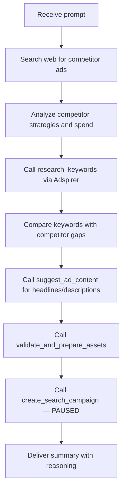

Perplexity Computer is an autonomous AI agent that can research, plan, and execute complex tasks. When connected to Adspirer, it becomes a **search-powered ad manager** — combining real-time web research with direct access to your Google Ads, Meta Ads, LinkedIn Ads, and TikTok Ads accounts.

This guide walks through real workflows showing what Perplexity Computer + Adspirer can do together.

## Why Perplexity Computer for Ads?

Most AI ad tools give you either **research** or **execution**. Perplexity Computer gives you both in a single workflow:

| Traditional Approach | Perplexity Computer + Adspirer |
|---------------------|-------------------------------|
| Research competitors manually in browser | Computer searches the web for competitor ads, strategies, and spend |
| Copy insights into a spreadsheet | Computer stores context and uses it in the next step |
| Switch to Google Ads dashboard to create campaign | Computer calls Adspirer tools to create the campaign directly |
| Manually pull performance data weekly | Computer fetches metrics via Adspirer and formats a report |

The key difference: **no context switching**. Research flows directly into action.

## Prerequisites

<Note>
- **Perplexity Max** subscription ($200/mo) for Computer — or **Pro** ($20/mo) for connector-only access
- **Adspirer account** ([free to start](https://adspirer.ai/sign-up?utm_source=docs&utm_medium=guide&utm_content=signup)) — 15 free tool calls/month
- At least one connected ad platform (Google Ads, Meta Ads, LinkedIn Ads, or TikTok Ads)
- Adspirer connector already set up in Perplexity — see [Perplexity Setup Guide](/ai-clients/perplexity)
</Note>

## Workflow 1: Competitor Research → Campaign Creation

The most powerful workflow. Perplexity researches your market on the web, then creates a campaign based on real competitive intelligence.

### The Prompt

<Prompt description="Research competitors on the web, then create a Google Ads campaign using real keyword data from Adspirer." actions={["copy"]}>
I'm launching a B2B SaaS for project management targeting remote teams.

1. Research the top 5 competitors in this space — what are they spending on Google Ads? What keywords are they targeting?
2. Using Adspirer, research Google Ads keywords for "project management software for remote teams" — show me search volume, CPC, and competition
3. Identify keyword gaps — terms competitors aren't targeting that have decent volume
4. Create a Google Search campaign with $50/day budget targeting the best opportunities
5. Give me a summary of what you created and why
</Prompt>

### What Computer Does



The campaign is created **PAUSED** — you review targeting, keywords, and ad copy before enabling it.

## Workflow 2: Cross-Platform Performance Audit

Use Perplexity's search to benchmark your performance against industry standards, then audit your actual data.

### The Prompt

<Prompt description="Benchmark your ad performance against industry data from the web, then audit via Adspirer." actions={["copy"]}>
Audit my ad performance across all connected platforms for the last 30 days.

First, search the web for current industry benchmarks for SaaS companies:
- Average CPC, CTR, conversion rate, and ROAS for Google Ads
- Average CPL and engagement rate for LinkedIn Ads
- Average CPA and frequency benchmarks for Meta Ads

Then pull my actual performance data from Adspirer and compare against those benchmarks.
Flag anything significantly above or below industry average.
Give me a prioritized action list.
</Prompt>

### What Computer Does

1. **Searches the web** for current SaaS advertising benchmarks
2. **Calls `get_campaign_performance`** for each connected platform via Adspirer
3. **Calls `analyze_wasted_spend`** to find zero-conversion keywords
4. **Compares** your metrics against industry benchmarks
5. **Delivers** a prioritized action list with estimated savings

## Workflow 3: Market Entry Research

Planning to advertise in a new market? Let Computer research the landscape before you spend a dollar.

### The Prompt

<Prompt description="Full market research before launching ads in a new vertical." actions={["copy"]}>
I'm considering advertising my accounting software to small businesses in Texas.

Research this market for me:
1. Search the web — who are the top advertisers in this space? What channels are they using?
2. Research Google Ads keywords for "small business accounting software Texas" via Adspirer
3. Research LinkedIn targeting options for small business owners in Texas
4. Estimate a 30-day test budget across Google + LinkedIn
5. Don't create anything yet — just give me a go/no-go recommendation with data
</Prompt>

This workflow is **read-only** — Computer researches and recommends without creating any campaigns.

## Workflow 4: Wasted Spend Recovery

Find and fix wasted ad spend across all platforms.

### The Prompt

<Prompt description="Find wasted spend across all platforms and create an optimization plan." actions={["copy"]}>
Where am I wasting money on ads?

1. Analyze Google Ads search terms — find keywords with 10+ clicks and zero conversions
2. Check Meta Ads for creative fatigue — any ads with frequency > 3 and declining CTR?
3. Review LinkedIn campaigns — which audience segments have the highest CPA?
4. Search the web for current best practices on Google Ads negative keyword strategy
5. Give me a step-by-step plan to cut waste and reallocate budget to winners
</Prompt>

## Workflow 5: Ad Copy Optimization

Let Computer research what's working in your industry, then improve your ads.

### The Prompt

<Prompt description="Research winning ad copy patterns, then optimize your existing ads." actions={["copy"]}>
I want to improve my Google Ads copy.

1. Search the web for high-performing Google Ads copy examples in the SaaS/project management space
2. Pull my current ad headlines and descriptions from Adspirer
3. Analyze what my top competitors are saying in their ads
4. Suggest 5 new headline variations and 3 new description variations based on:
   - Competitor differentiation
   - Benefit-focused messaging
   - Current CTR data from my account
5. Update my ad copy with the best variations using Adspirer
</Prompt>

## Tips for Better Results

### Be Specific About Research vs Action

Computer can both research and act. Be explicit about which you want:

| Prompt | What Happens |
|--------|-------------|
| *"Research keywords for my SaaS"* | Computer calls `research_keywords` — **read-only** |
| *"Create a campaign for my SaaS"* | Computer researches AND creates — **write action** |
| *"Research the market but don't create anything"* | Computer researches only — **read-only** |

### Chain Web Research with Adspirer Tools

The most valuable prompts combine web research with platform data:

- *"Search the web for [industry] benchmarks, then compare against my actual performance"*
- *"Research what competitors are doing, then find keywords they're missing"*
- *"Find industry best practices for [strategy], then audit my account against them"*

### Use Multi-Step Instructions

Computer excels at complex, numbered instructions. Give it a clear sequence:

```
1. Do this first
2. Then do this
3. Based on steps 1-2, do this
4. Finally, summarize everything
```

### Review Before Enabling

Every campaign Computer creates via Adspirer starts **PAUSED**. Always review:

- Keyword targeting and match types
- Ad copy and headlines
- Budget and bid strategy
- Audience targeting
- Geographic targeting

## Perplexity Computer vs Other Agents for Ads

| Feature | Perplexity Computer | Manus | Codex |
|---------|:------------------:|:-----:|:-----:|
| Web research + ads | Yes (native) | Yes | No |
| Campaign creation | Yes | Yes | Yes |
| Interactive dashboards | Yes | Yes | No |
| Scheduled briefs | No | Yes | Yes |
| Monitoring alerts | No | Yes | Yes |
| Auth method | OAuth | API Key | OAuth |
| Price | $200/mo (Max) | Varies | Varies |

**Bottom line:** Perplexity Computer is best when you need **research-driven ad management** — combining market intelligence with campaign execution. For ongoing monitoring and scheduled tasks, pair it with [Manus](/ai-clients/manus) or [Codex](/ai-clients/codex).

## Get Started

<Steps>
  <Step title="Set up Perplexity + Adspirer">
    Follow the [Perplexity Setup Guide](/ai-clients/perplexity) to add Adspirer as a custom connector in Perplexity Computer.
  </Step>
  <Step title="Connect your ad platforms">
    Link your Google Ads, Meta Ads, LinkedIn Ads, and/or TikTok Ads accounts at [adspirer.ai](https://adspirer.ai?utm_source=docs&utm_medium=guide&utm_content=perplexity-computer).
  </Step>
  <Step title="Try the competitor research workflow">
    Copy the Competitor Research → Campaign Creation prompt from Workflow 1 above and customize it for your business.
  </Step>
</Steps>

## Related Documentation

- [Perplexity Setup Guide](/ai-clients/perplexity) — Connect Adspirer to Perplexity Computer
- [Computer Use Agents](/knowledge-base/computer-use-agents) — Overview of all supported autonomous agents
- [Agent Skills Overview](/agent-skills/overview) — Teach your AI the right workflows
- [Google Ads Integration](/ad-platforms/google-ads) — Full Google Ads tool reference
- [Pricing & Plans](https://www.adspirer.com/pricing)
