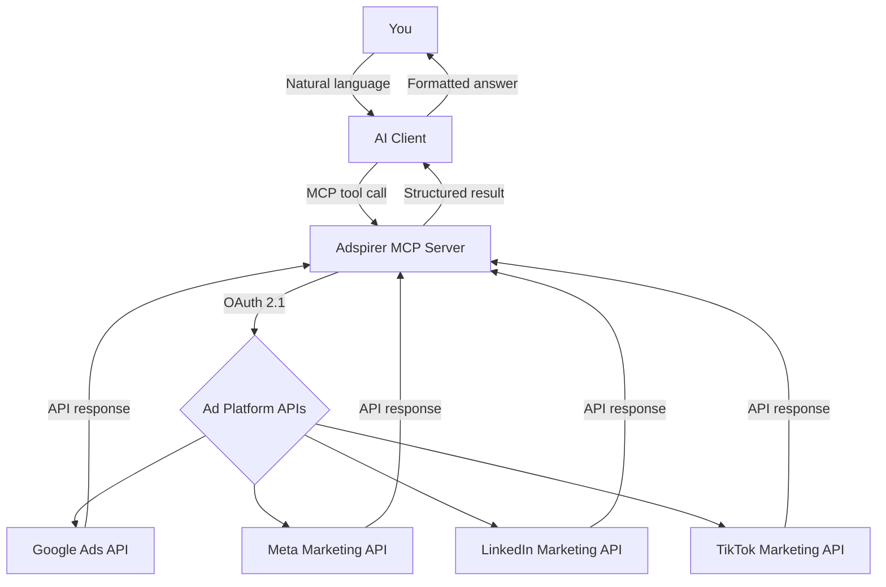
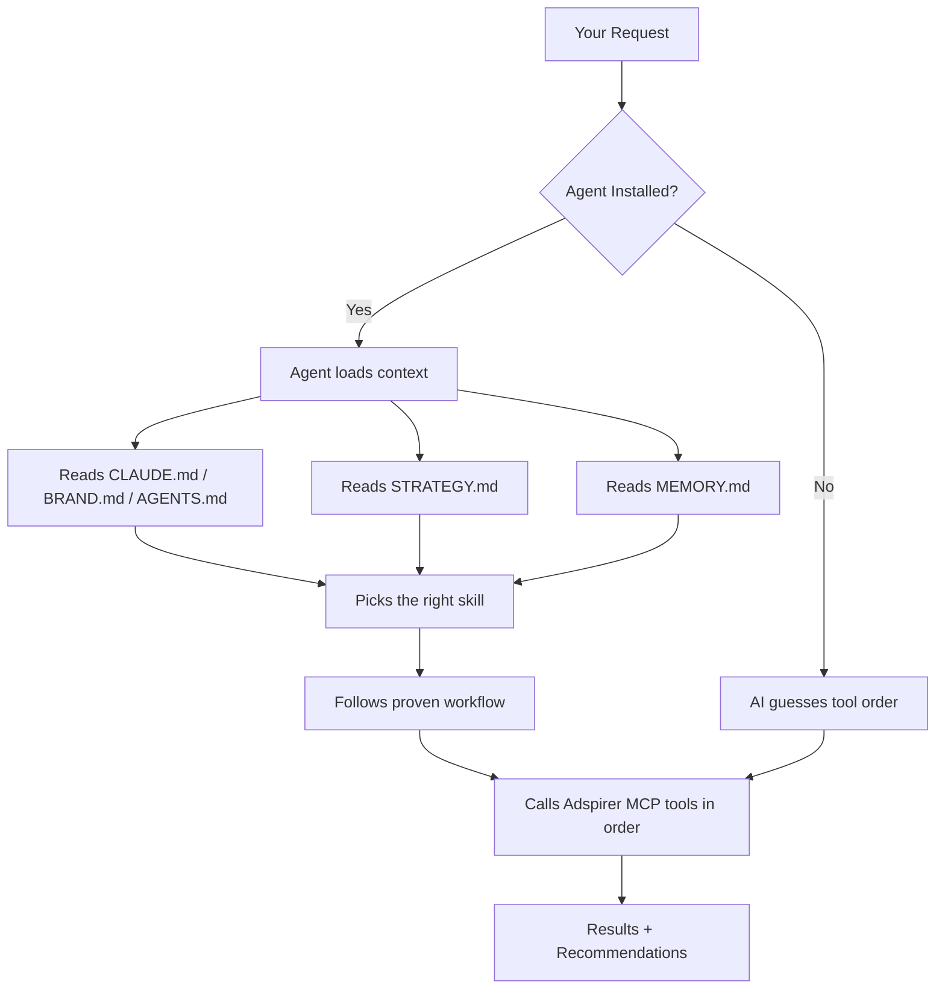

Adspirer sits between your AI assistant and your ad platforms. You talk to your AI in natural language. Adspirer translates that into authenticated API calls to Google Ads, Meta Ads, LinkedIn Ads, and TikTok Ads — and returns results back to your conversation.

## The Full Pipeline



Every interaction follows this path. Whether you're pulling a performance report or creating a campaign, the pipeline is the same.

---

## Layer 1: Your AI Client

Your AI assistant — Claude, ChatGPT, Gemini CLI, Perplexity, Cursor, Codex, or any MCP-compatible client — is the interface. You describe what you want in plain English:

- *"How are my Google Ads performing this month?"*
- *"Create a LinkedIn campaign targeting IT Directors"*
- *"Find wasted spend across all platforms"*

The AI determines which Adspirer tools to call and in what order. With [skills](/agent-skills/overview) installed, it follows proven workflows. Without skills, it makes its best guess.

### What the AI Client Provides

| Capability | Description |
|-----------|-------------|
| Natural language understanding | Translates your request into tool calls |
| Multi-step reasoning | Chains multiple tools in sequence |
| Context from files | Reads brand context, strategy, and memory files |
| User confirmation | Asks before spend-affecting actions |
| Result formatting | Presents data as tables, charts, and recommendations |

---

## Layer 2: MCP (Model Context Protocol)

<Tooltip tip="Model Context Protocol — an open standard created by Anthropic for connecting AI assistants to external tools">MCP</Tooltip> is the protocol that connects your AI client to Adspirer. It's an open standard — any AI client that supports MCP can use Adspirer.

### What MCP Does

- **Tool discovery:** Your AI client discovers Adspirer's 100+ tools with descriptions and parameters
- **Tool invocation:** When the AI decides to use a tool, it sends a structured request via MCP
- **Response delivery:** Adspirer returns structured results that the AI formats for you
- **Authentication:** OAuth flows are triggered transparently through MCP

### One URL, All Platforms

Every AI client connects to the same MCP endpoint:

```
https://mcp.adspirer.com/mcp
```

This single URL gives access to all 100+ tools across all 4 ad platforms. Your AI client doesn't need to know about Google Ads APIs, Meta APIs, or LinkedIn APIs — Adspirer handles all of that behind the MCP layer.

### Tool Categories

Adspirer exposes tools in two categories:

- <Badge color="green">Read</Badge> **tools** pull data and analyze performance. Safe to run anytime. No spending impact. Examples: `get_campaign_performance`, `research_keywords`, `analyze_wasted_spend`.
- <Badge color="red">Write</Badge> **tools** create or modify campaigns. Require user confirmation. Affect spend. Examples: `create_search_campaign`, `update_campaign`, `add_keywords`.

---

## Layer 3: Authentication (OAuth 2.1 with PKCE)

When you first connect an ad platform, Adspirer uses **OAuth 2.1 with PKCE** — the same standard used by banking apps.

### The OAuth Flow

<Steps>
  <Step title="You trigger a connection">
    Either through your AI client's MCP settings or by running setup (`/adspirer:setup`).
  </Step>
  <Step title="Browser opens">
    You're redirected to Google/Meta/LinkedIn/TikTok's login page. You sign in with your existing credentials.
  </Step>
  <Step title="You authorize permissions">
    You see exactly what Adspirer is requesting (read campaigns, create ads, manage budgets). You approve.
  </Step>
  <Step title="Tokens are issued">
    The ad platform issues an access token (1-hour lifetime) and refresh token (30-day lifetime). Adspirer stores these encrypted at rest.
  </Step>
  <Step title="Automatic refresh">
    When the access token expires, Adspirer automatically uses the refresh token to get a new one — no re-login needed until the refresh token expires (30 days).
  </Step>
</Steps>

### What Adspirer Never Sees

- Your ad platform password
- Your billing/payment information
- Data from accounts you haven't connected
- Personal data beyond what's in your ad account settings

---

## Layer 4: Ad Platform APIs

Adspirer translates MCP tool calls into native API calls for each platform:

| Adspirer Tool | Platform API Called | What It Does |
|---------------|-------------------|-------------|
| `get_campaign_performance` | Google Ads API | Pulls campaign metrics (spend, CTR, CPA, ROAS) |
| `research_keywords` | Google Keyword Planner API | Returns keyword ideas with real CPC data |
| `create_search_campaign` | Google Ads API | Creates a Search campaign (PAUSED) |
| `get_meta_campaign_performance` | Meta Marketing API | Pulls Meta campaign metrics |
| `create_meta_image_campaign` | Meta Marketing API | Creates an image ad campaign |
| `get_linkedin_campaign_performance` | LinkedIn Marketing API | Pulls LinkedIn campaign metrics |
| `create_linkedin_image_campaign` | LinkedIn Marketing API | Creates a sponsored content campaign |

Each API call uses the OAuth token from your authenticated session. Adspirer handles rate limiting, pagination, error handling, and response formatting.

---

## Layer 5: Skills & Agent (Optional)

Without skills, your AI calls tools individually and guesses the workflow. With skills and the agent, you get structured workflows, brand awareness, and strategy persistence.



### What the Agent Adds

| Without Agent | With Agent |
|--------------|-----------|
| Raw tool access | Brand-aware tool usage |
| AI guesses workflow | Proven step-by-step workflows |
| No memory between sessions | Past decisions persist in MEMORY.md |
| No strategy persistence | Directives saved in STRATEGY.md |
| No safety enforcement | Skills enforce read-before-write, confirmation gates |

See [Performance Marketing Agent](/agent-skills/agent) for the full architecture.

---

## Safety Model

Adspirer's safety model operates at multiple layers:

| Layer | Protection | Who Enforces It |
|-------|-----------|----------------|
| **OAuth scoping** | You authorize exactly what Adspirer can do | Ad platform (Google, Meta, etc.) |
| **Tool types** | Read tools are safe; Write tools require confirmation | Adspirer MCP server |
| **PAUSED creation** | All campaigns start paused | Adspirer `create_*` tools |
| **Skill workflows** | Research → validate → confirm → create | SKILL.md files |
| **Agent rules** | Read-before-write, budget guardrails, no auto-retry | Agent prompt + rules files |
| **User confirmation** | AI asks before any spend-affecting action | AI client + skill |
| **Post-creation verification** | Agent verifies ads, keywords, extensions exist | Agent prompt |

No single layer is sufficient on its own. The safety model works because each layer reinforces the others.

---

## Data Flow Summary

| What | Where It Lives | Who Can Access It |
|------|---------------|-------------------|
| Your ad platform credentials | Google/Meta/LinkedIn/TikTok servers | Only the ad platform |
| OAuth tokens | Adspirer servers (encrypted) | Adspirer (for API calls) |
| Campaign performance data | Ad platform APIs (real-time) | Your AI client (via Adspirer) |
| Brand context (CLAUDE.md) | Your local machine | Your AI client |
| Strategy directives | Your local machine (STRATEGY.md) | Your AI client |
| Memory | Your local machine (MEMORY.md) | Your AI client |

Adspirer reads your campaign data in real-time and passes it to your AI client. It does not permanently store campaign data, ad copy, or targeting settings.

## Related Documentation

- [How MCP Works](/mcp) — Deep dive into the Model Context Protocol
- [Security & Data Privacy](/knowledge-base/security) — OAuth, encryption, and data handling
- [Agent Skills Overview](/agent-skills/overview) — Skills, workflows, and safety rules
- [Performance Marketing Agent](/agent-skills/agent) — Agent architecture
- [Tool Catalog](/agent-skills/tools) — All 100+ tools
