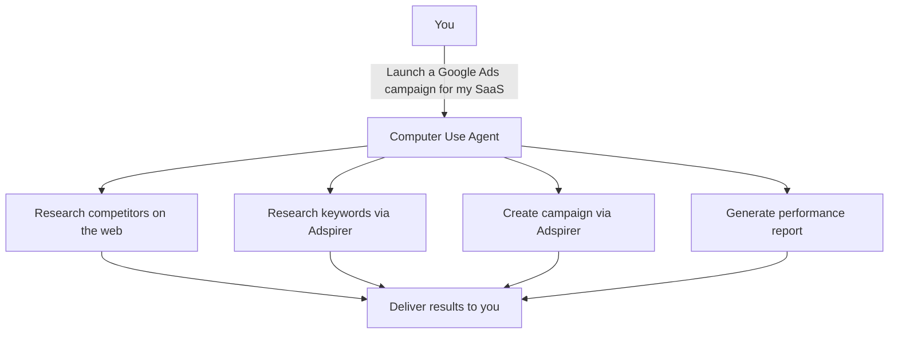

Computer use agents are the next evolution of AI assistants — from tools you prompt to agents that **execute**. Instead of asking an AI to help you write an ad, you tell it to research your market, create a campaign, and monitor performance. The agent handles the rest.

Adspirer connects to multiple computer use agents, giving them direct access to 100+ advertising tools across Google Ads, Meta Ads, LinkedIn Ads, and TikTok Ads.

## What Are Computer Use Agents?

Traditional AI assistants answer questions. Computer use agents **take action**. They can:

- Break complex goals into subtasks and execute them sequentially
- Call external tools (like Adspirer's MCP server) to interact with real platforms
- Run for extended periods — minutes, hours, or on a schedule
- Chain web research, data analysis, and platform actions in a single workflow
- Operate autonomously with minimal human intervention

The key difference: you describe the **outcome** you want, not the steps to get there.

## How They Work with Adspirer

Computer use agents connect to Adspirer via <Tooltip tip="Model Context Protocol — an open standard for connecting AI assistants to external tools">MCP</Tooltip> — the same protocol used by all Adspirer-compatible AI clients. The agent discovers Adspirer's 100+ tools and uses them as part of its autonomous workflows.

The agent decides **which tools to call, in what order, and how to combine results**. With Adspirer connected, it has direct access to your ad accounts — no dashboards, no manual steps.

## Supported Computer Use Agents

Adspirer works with multiple autonomous agents. Each connects via MCP and gets access to the same 100+ tools.

| Agent | Auth | Autonomous | Web Research | Best For | Setup Guide |
|-------|------|:----------:|:------------:|----------|:-----------:|
| **Perplexity Computer** | OAuth | Yes | Yes (native) | Research + campaign creation | [Guide](/ai-clients/perplexity) |
| **Manus** | API Key | Yes | Yes | Dashboards, scheduled briefs, deep research | [Guide](/ai-clients/manus) |
| **Codex** | OAuth | Yes | No | Scheduled monitoring, daily checks | [Guide](/ai-clients/codex) |
| **OpenClaw** | OAuth / API Key | Semi | No | Pre-configured ad agent, CLI workflows | [Guide](/ai-clients/openclaw) |

### Perplexity Computer

Perplexity Computer orchestrates 19+ AI models to execute complex tasks. Its unique advantage is **native web search** — it can research competitors, market trends, and industry benchmarks in real-time, then immediately act on that research using Adspirer tools.

- **Plan required:** Perplexity Max ($200/mo) for Computer; Pro ($20/mo) for connectors only
- **How it connects:** Custom connector in Perplexity Computer → Connectors → OAuth
- **Unique capability:** Combines real-time search with ad platform actions in a single workflow

**Example workflow:** *"Research the top 5 competitors for project management SaaS, analyze their Google Ads strategy, then create a campaign targeting keywords they're missing. Budget $50/day."* — Perplexity Computer searches the web, pulls keyword data via Adspirer, creates the campaign, and delivers a summary.

### Manus

Manus is a general-purpose autonomous agent that can browse the web, write code, and generate interactive dashboards. It connects to Adspirer via API key authentication.

- **Plan required:** Manus account (any tier)
- **How it connects:** Custom MCP server with API key in Authorization header
- **Unique capability:** Interactive dashboard generation, scheduled email briefs, 24/7 monitoring

**Example workflow:** *"Set up a daily performance brief across all my ad platforms and email it to me every morning at 9 AM."* — Manus configures monitoring, fetches data daily, and delivers formatted reports.

### Codex

OpenAI's Codex operates as a background agent that can run tasks autonomously, including on a schedule.

- **Plan required:** Codex subscription
- **How it connects:** One-command installer + OAuth
- **Unique capability:** Scheduled autonomous tasks (e.g., daily performance checks at 8 AM)

**Example workflow:** *"Every Monday at 9 AM, pull my Google Ads performance for the past week and flag any keywords with spend > $50 and zero conversions."*

### OpenClaw

OpenClaw is a CLI-based agent with Adspirer's skill file pre-bundled. It runs locally on your machine with direct terminal access.

- **Plan required:** OpenClaw (open source)
- **How it connects:** Plugin install with bundled 14KB skill file
- **Unique capability:** Pre-configured advertising agent with safety rules built in

## Computer Use Agents vs Chat Apps

| | Chat Apps (ChatGPT, Claude, Perplexity Search) | Computer Use Agents (Perplexity Computer, Manus, Codex) |
|---|---|---|
| **Interaction** | You ask, AI responds | You define a goal, agent executes |
| **Duration** | Single conversation | Can run for hours or on a schedule |
| **Multi-step** | You guide each step | Agent plans and executes autonomously |
| **Web research** | Limited or manual | Built-in (Perplexity, Manus) |
| **Dashboards** | Text/table output | Interactive charts and reports (Manus) |
| **Monitoring** | Manual checks | Automated alerts and scheduled briefs |
| **Best for** | Quick queries, ad-hoc tasks | Complex workflows, ongoing management |

<Tip>
You don't have to choose one or the other. Many users use **chat apps for quick queries** (e.g., "How's my Google Ads CTR this week?") and **computer use agents for complex workflows** (e.g., "Audit all platforms, find wasted spend, and create an optimization plan").
</Tip>

## What Computer Use Agents Can Do with Adspirer

| Workflow | What the Agent Does | Which Agents |
|----------|---------------------|:------------:|
| **Full campaign launch** | Research market → find keywords → validate assets → create campaign (PAUSED) | All |
| **Cross-platform audit** | Pull performance from all platforms → identify waste → recommend optimizations | All |
| **Competitor research + action** | Search the web for competitor ads → analyze strategy → create campaigns to compete | Perplexity, Manus |
| **Daily performance brief** | Fetch metrics → format summary → deliver via email or dashboard | Manus, Codex |
| **Automated monitoring** | Watch for CPA spikes, budget overruns, or ROAS drops → alert you | Manus, Codex |
| **Interactive dashboard** | Generate charts, KPI cards, and data tables from ad performance data | Manus, Perplexity |
| **Budget optimization** | Analyze ROAS across campaigns → recommend reallocation → execute after approval | All |

## Safety with Autonomous Agents

Autonomous agents acting on your ad accounts sounds risky. Adspirer has multiple safety layers:

1. **All campaigns created PAUSED** — No live spend without your review
2. **OAuth scoping** — Agents only get the permissions you authorize
3. **Read-before-write** — Skills enforce research and validation before any creation
4. **Confirmation gates** — Spend-affecting actions require your approval
5. **No auto-retry** — Failed actions stop and report, never retry automatically
6. **Sandboxed execution** — Agents like Perplexity Computer run in secure sandboxes, isolated from your local machine

See [Security & Data Privacy](/knowledge-base/security) for the full security model.

## Getting Started

<CardGroup cols={2}>
  <Card title="Perplexity Setup" icon="/icons/perplexity.svg" href="/ai-clients/perplexity">
    Connect via OAuth in Perplexity Computer. Search + ads in one agent.
  </Card>
  <Card title="Manus Setup" icon="wand-magic-sparkles" href="/ai-clients/manus">
    Connect via API key. Dashboards, briefs, and monitoring.
  </Card>
  <Card title="Codex Setup" icon="/icons/codex.svg" href="/ai-clients/codex">
    One-command install. Scheduled autonomous tasks.
  </Card>
  <Card title="OpenClaw Setup" icon="/icons/openclaw.svg" href="/ai-clients/openclaw">
    Pre-configured ad agent with bundled skills.
  </Card>
</CardGroup>

## FAQ

<AccordionGroup>
<Accordion title="Are computer use agents safe for managing ad spend?">
Yes. Adspirer enforces multiple safety layers regardless of which agent connects. All campaigns start PAUSED, spend-affecting actions require confirmation, and OAuth scoping limits what the agent can access. The agent never has direct access to your ad platform credentials.
</Accordion>
<Accordion title="Which computer use agent is best for advertising?">
It depends on your needs. **Perplexity Computer** is best for research-heavy workflows (competitor analysis + campaign creation). **Manus** is best for ongoing management (dashboards, scheduled briefs, monitoring). **Codex** is best for scheduled automation (daily checks, weekly reports). You can use multiple agents with the same Adspirer account.
</Accordion>
<Accordion title="Do tool calls from computer use agents count against my Adspirer limit?">
Yes. All tool calls count against your monthly limit regardless of which agent makes them. A Perplexity Computer workflow that calls 10 Adspirer tools uses 10 calls from your plan.
</Accordion>
<Accordion title="Can a computer use agent accidentally spend my ad budget?">
No. Every campaign Adspirer creates starts in PAUSED status — you must manually enable it. The agent cannot unpause campaigns or increase budgets on existing campaigns. See [Capabilities & Limitations](/knowledge-base/capabilities) for the full list.
</Accordion>
</AccordionGroup>
