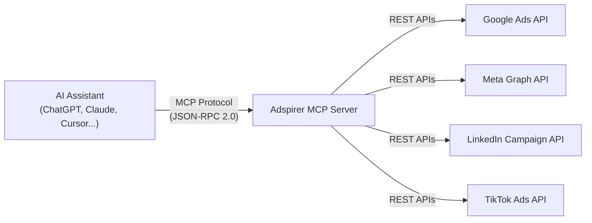
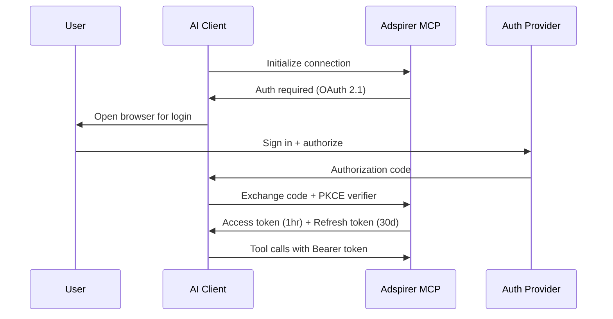

Adspirer connects AI assistants to ad platforms using MCP — the open protocol created by Anthropic for AI tool integration.

## What is MCP?

Model Context Protocol (MCP) is an open standard that lets AI assistants call external tools. Instead of each AI client building custom integrations, MCP provides a universal interface:



One server, any AI client. Your Adspirer account works with ChatGPT, Claude, Claude Code, Cursor, Codex, OpenClaw, and Windsurf — all connecting to the same endpoint.

## MCP Server URL

```
https://mcp.adspirer.com/mcp
```

This single URL is used across all AI clients. The server auto-detects the transport type based on the client's request.

## Transport

Adspirer supports two MCP transport mechanisms:

| Transport | Used By | How It Works |
|-----------|---------|-------------|
| **Streamable HTTP** | ChatGPT, Claude, Cursor, Windsurf | HTTP POST for requests, Server-Sent Events (SSE) for streaming responses. Supports progress updates during long operations. |
| **STDIO** | Claude Code (local) | JSON-RPC over stdin/stdout. Used for local terminal-based tools. |

### Streamable HTTP

The primary transport for web and IDE clients. Requests are JSON-RPC 2.0 over HTTP:

```json
{
  "jsonrpc": "2.0",
  "id": "req-1",
  "method": "tools/call",
  "params": {
    "name": "get_campaign_performance",
    "arguments": { "lookback_days": 30 }
  }
}
```

Responses stream back via SSE with heartbeats every 30 seconds, allowing real-time progress updates during campaign creation (which can take 5-30 seconds).

### Why Not WebSockets?

SSE is HTTP-native — works through firewalls, proxies, and CDNs without special configuration. WebSockets require persistent connections that many enterprise networks block.

## Authentication

Adspirer uses **OAuth 2.1 with PKCE** — the most secure standard for AI tool authentication.

### How It Works



### Key Security Properties

- **PKCE (Proof Key for Code Exchange):** Prevents authorization code interception. Every auth flow generates a unique code verifier — even if someone intercepts the code, they can't use it without the verifier.
- **Short-lived tokens:** Access tokens expire in 1 hour. Refresh tokens last 30 days.
- **No passwords stored:** Adspirer never sees your Google, Meta, LinkedIn, or TikTok passwords. OAuth tokens are scoped to only the permissions you authorize.
- **Revocable:** Disconnect anytime from your ad platform's security settings or from [adspirer.ai](https://adspirer.ai?utm_source=docs&utm_medium=page&utm_content=account).

## Tool Discovery

When an AI client connects, it discovers available tools via `tools/list`:

```json
{
  "jsonrpc": "2.0",
  "id": "req-0",
  "method": "tools/list"
}
```

The server returns all 100+ tools with names, descriptions, and input schemas. The AI client uses these schemas to understand what parameters each tool accepts and to validate inputs before calling.

### Tool Categories

| Category | Tools | Examples |
|----------|-------|---------|
| **Read** (`get_*`, `list_*`, `analyze_*`) | ~60 | Pull performance data, list campaigns, analyze trends |
| **Write** (`create_*`, `update_*`) | ~25 | Create campaigns, update budgets |
| **System** (`get_connections_status`, `switch_primary_account`) | ~8 | Account management, connection checks |
| **Automation** (`schedule_*`, `create_monitor`) | ~8 | Recurring tasks, alerts |

### Tool Safety Model

- **Read tools** auto-execute — no confirmation needed
- **Write tools** require user confirmation before execution
- All campaigns are created **PAUSED** — you review before spending

## Tool Execution

When the AI calls a tool, the server:

1. **Validates input** — Checks types, ranges, and required fields against the tool's JSON Schema
2. **Authenticates** — Verifies the OAuth token and resolves the user's ad accounts
3. **Checks quota** — Confirms the user has tool calls remaining on their plan
4. **Executes** — Calls the relevant ad platform API (Google, Meta, LinkedIn, or TikTok)
5. **Returns results** — Formatted text response with tables, recommendations, or confirmation

### Error Handling

If something goes wrong, the server returns structured errors with recovery steps:

```json
{
  "error": {
    "code": -32002,
    "message": "No Google Ads account connected",
    "data": {
      "recovery_steps": [
        "Visit adspirer.ai/connections",
        "Click 'Connect Google Ads'"
      ]
    }
  }
}
```

## Quota System

Adspirer uses a tool-call-based pricing model:

| Plan | Tool Calls/Month | Price |
|------|-----------------|-------|
| Free | 10 | $0 |
| Plus | 50 | $25/mo |
| Pro | 100 | $75/mo |

Each tool invocation counts as 1 call regardless of platform. A typical campaign creation uses 4-6 calls (research + validate + create). Performance queries use 1 call each.

See [full pricing](https://www.adspirer.com/pricing?utm_source=docs&utm_medium=page&utm_content=pricing).

## Infrastructure

| Component | Technology |
|-----------|-----------|
| **Runtime** | Python 3.11 + FastAPI (async) |
| **MCP SDK** | Official MCP Python SDK |
| **Hosting** | Google Cloud Run (auto-scaling) |
| **Sessions** | Redis (auto-expiring, 1hr TTL) |
| **Auth** | OAuth 2.1 with PKCE |
| **Logging** | Structured JSON logs |

### Uptime

The MCP server runs on Cloud Run with minimum 1 instance always warm — no cold starts for the first request. Auto-scales based on concurrent connections.

## Supported Clients

Any MCP-compatible client can connect. Currently tested and documented:

| Client | Transport | Setup Guide |
|--------|-----------|-------------|
| ChatGPT (Plus/Pro) | Streamable HTTP | [ChatGPT Setup](/ai-clients/chatgpt) |
| Claude (Pro/Max/Team/Enterprise) | Streamable HTTP | [Claude Setup](/ai-clients/claude) |
| Claude Code | STDIO | [Claude Code Setup](/ai-clients/claude-code) |
| Cursor | Streamable HTTP | [Cursor Setup](/ai-clients/cursor) |
| Codex | Streamable HTTP | [Codex Setup](/ai-clients/codex) |
| OpenClaw | Streamable HTTP | [OpenClaw Setup](/ai-clients/openclaw) |
| Windsurf | Streamable HTTP | [Windsurf Setup](/ai-clients/windsurf) |

## FAQ

<AccordionGroup>
<Accordion title="What's the difference between the MCP server and the docs MCP?">
Two separate things. The **product MCP server** at `mcp.adspirer.com/mcp` connects AI assistants to ad platforms (100+ tools). The **docs MCP** at `www.adspirer.com/docs/mcp` is auto-generated by Mintlify and lets AI assistants search Adspirer's documentation. They serve different purposes.
</Accordion>
<Accordion title="Can I build my own MCP client that connects to Adspirer?">
Yes. Any client implementing the MCP specification can connect. Use the MCP SDK for your language (Python, TypeScript, etc.), point it at `https://mcp.adspirer.com/mcp`, and implement OAuth 2.1 for authentication.
</Accordion>
<Accordion title="Is MCP the same as an API?">
MCP is a protocol layer on top of HTTP. Think of it as a standardized way for AI assistants to discover and call APIs. Instead of writing custom API integration code, the AI client speaks MCP and automatically understands what tools are available and how to call them.
</Accordion>
<Accordion title="Why not just use a REST API?">
MCP adds tool discovery, streaming, and a standard authentication flow that AI clients already understand. With a REST API, each AI client would need custom integration code. With MCP, any compliant client connects immediately — no custom code needed.
</Accordion>
</AccordionGroup>

## Related Documentation

- [Quickstart](/quickstart) — Get connected in 5 minutes
- [Agent Skills](/agent-skills/overview) — Teach your AI the right workflows
- [Core Workflows](/agent-skills/workflows) — Tool sequences for every platform
- [Pricing & Plans](https://www.adspirer.com/pricing?utm_source=docs&utm_medium=page&utm_content=pricing)
